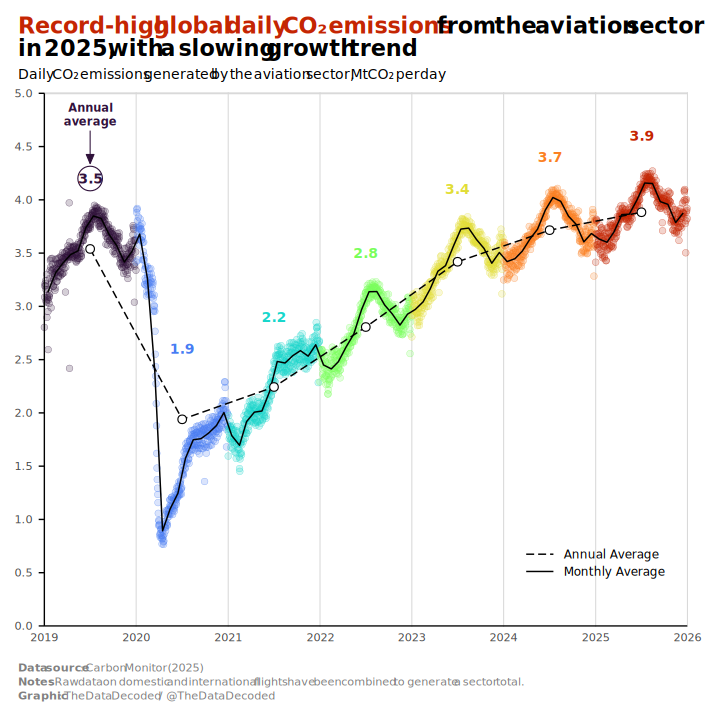
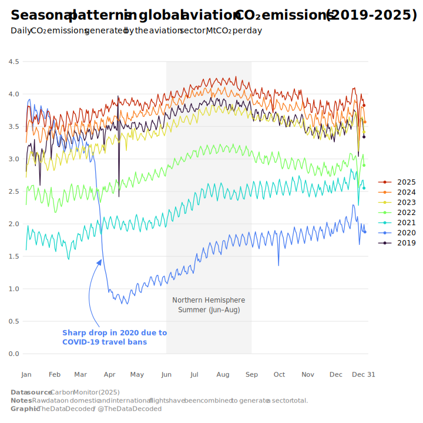
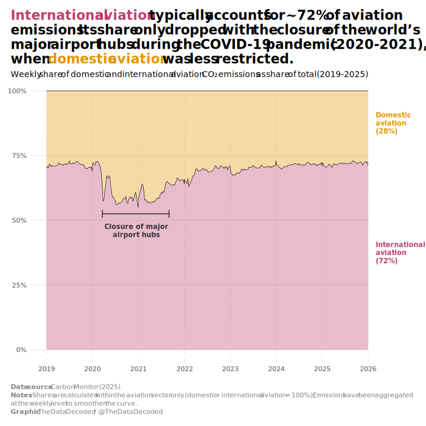

```{r project-path}
# Set project path
project_path <- file.path("visuals", "2026-03-global-aviation-co2-emissions")
```


```{r load-packages}

library(readxl)
library(dplyr)
library(tidyr)
library(ggplot2)
library(lubridate)
library(sysfonts)
library(ggtext)
library(viridis) # for viridis_pal

```

```{r import-data}

# Data from https://carbonmonitor.org/. Also see https://carbonmonitor-graced.com/index.html

# Path to the Excel file (adjust if not in working directory)
file_path <- file.path(project_path, "data", "carbon-monitor-GLOBAL-total-aviation.xlsx")

# Read the data from the first sheet (assume data starts at row 1 with headers)
emissions_data <- read_excel(file_path, sheet = 1)

```

```{r data-preparation}

# Process: sum to global aviation totals + extract day-of-year + year
aviation_doy <- emissions_data %>%
    # Parse date – use dmy() since you confirmed day/month/year format
    mutate(
        date = dmy(date),                     # or as.Date(date, format = "%d/%m/%Y")
        year = year(date),
        doy  = yday(date)                     # day of year: 1 = Jan 1, 365/366 = Dec 31
    ) %>%

    # Sum across countries → global daily total per sector/date
    group_by(date, year, doy, sector) %>%
    summarise(
        daily_co2_mt = sum(`MtCO2 per day`, na.rm = TRUE),
        .groups = "drop"
    ) 

aviation_doy_total <- aviation_doy %>% 
    group_by(date, year, doy) %>% 
    summarise(daily_co2_mt_total = sum(daily_co2_mt), .groups = "drop")

colors_turbo <- viridis_pal(
  option = "turbo", 
  direction = 1, 
  end = 0.9
)(7)

```

```{r load-font}

font_choice <- "Segoe UI"

font_add(font_choice,
         regular = "C:/Windows/Fonts/segoeui.ttf",
         bold = "C:/Windows/Fonts/segoeuib.ttf",
         italic = "C:/Windows/Fonts/segoeuii.ttf")

```

```{r data-preparation-emissions-all-years}

aviation_doy_total_point <- aviation_doy_total %>%
    mutate(
        month = month(date)           # 1–12
    ) %>%
    group_by(year, month) %>%
    mutate(
        monthly_avg = mean(daily_co2_mt_total, na.rm = TRUE)
    ) %>%
    ungroup() %>% 
    group_by(year) %>% 
    mutate(
        annual_avg = mean(daily_co2_mt_total, na.rm = TRUE),
        point_color = case_when(
            year == "2019" ~ colors_turbo[1],
            year == "2020" ~ colors_turbo[2],
            year == "2021" ~ colors_turbo[3],
            year == "2022" ~ colors_turbo[4],
            year == "2023" ~ colors_turbo[5],
            year == "2024" ~ colors_turbo[6],
            year == "2025" ~ colors_turbo[7],
        )
    )

annual_labels <- aviation_doy_total_point %>%
    filter(grepl("07-02", date)) %>% 
    mutate(annual_avg = round(annual_avg, 1),
           y_pos = annual_avg + 0.7)

```

```{r emissions-all-years-chart}

emissions_all_years <- ggplot(aviation_doy_total_point, aes(x = date, y = daily_co2_mt_total)) +
    geom_point(aes(fill = alpha(point_color, 0.20), color = alpha(point_color, 0.70)),
               size = 3, shape = 21,
               stroke = 0.25) +
    scale_color_identity() +
    scale_fill_identity() +
    geom_line(
        data = aviation_doy_total_point %>% filter(grepl("-15", date)),
        aes(x = date, y = monthly_avg, linetype = "Monthly Average"),
        inherit.aes = FALSE, linewidth = 0.7
    ) +
    geom_line(
        data = aviation_doy_total_point %>% filter(grepl("07-02", date)),
        aes(x = date, y = annual_avg, linetype = "Annual Average"),
        inherit.aes = FALSE, linewidth = 0.7
    ) +
    # Map the linetypes manually to get solid and dashed
    scale_linetype_manual(
        name = NULL, # Removes the legend title
        values = c("Monthly Average" = "solid", "Annual Average" = "42"),
        breaks = c("Annual Average", "Monthly Average")
    ) +
    
    # Adjust legend behavior
    guides(linetype = guide_legend(override.aes = list(linewidth = c(0.7, 0.7)))) +
    
    geom_point(data = aviation_doy_total_point %>% filter(grepl("07-02", date)),
               aes(x = date, y = annual_avg),
        size = 3.5, shape = 21, color = "black", fill = "white", stroke = 0.8
        ) +
    geom_point(data = annual_labels[1,], aes(x = date, y = y_pos),
               size = 11, shape = 21, color = colors_turbo[1], fill = NA, stroke = 0.8) +
    geom_segment(data = tibble(x = dmy("01-01-2019"), xend = dmy("31-12-2025"),
                               y = 5, yend = 5),
                 aes(x = x, xend = xend, y = y, yend = yend),
                 color = "grey85", linewidth = 0.9) +
    geom_segment(data = tibble(x = dmy("01-01-2019"), xend = dmy("01-01-2019"),
                               y = 0, yend = 5),
                 aes(x = x, xend = xend, y = y, yend = yend)) +
    geom_segment(data = tibble(x = dmy("01-01-2019"), xend = dmy("31-12-2025"),
                               y = 0, yend = 0),
                 aes(x = x, xend = xend, y = y, yend = yend)) +
    labs(
        title = paste0("<span style='color: #C42503;'>Record-high global daily CO₂ emissions</span> from the aviation sector",
                       "<br>",
                       "in 2025, with a slowing growth trend"),
        subtitle = paste("Daily CO₂ emissions generated by the aviation sector, MtCO₂ per day"),
        caption = paste0("<b>Data source</b>: Carbon Monitor (2025)",
                         "<br>",
                         "<b>Notes</b>: Raw data on domestic and international flights have been combined to generate a sector total.", "<br>",
                         "<b>Graphic</b>: The Data Decoded / @TheDataDecoded")
    ) +
    theme_minimal(base_size = 14, base_family = font_choice) +
    scale_x_date(
        date_breaks = "1 year",
        date_labels = "%Y",
        guide          = guide_axis(minor = TRUE),
        expand = expansion(mult = c(0, 0.02))
    ) +
    scale_y_continuous(breaks = seq(0, 5, 0.5),
                       limits = c(0, 5),
                       expand = expansion(mult = c(0.002, 0.002))) +
    coord_cartesian(clip = "off") +
    theme(
        legend.position = c(0.83, 0.12),
        legend.key.width = unit(1.2, "cm"),
        legend.text = element_text(size = 12),
        axis.title = element_text(face = "bold"),
        panel.grid.major.x = element_line(
            colour    = "grey85",
            linewidth = 0.5,
            linetype  = "solid"
        ),
        panel.grid.major.y = element_blank(),
        panel.grid.minor = element_blank(),
        plot.margin = margin(r = 20, b = 18, l = 18, t = 18, unit = "pt"),
        axis.title.x = element_blank(),
        axis.title.y = element_blank(),
        axis.ticks.y = element_line(),
        axis.ticks.length.y = unit(0.2, "cm"),
        plot.title.position = "plot",
        plot.title = element_markdown(hjust = 0, face = "bold", margin = margin(b = 5),
                                      lineheight = 1, size = rel(1.6)),
        plot.caption.position = "plot",
        plot.caption = element_markdown(hjust = 0, vjust = 0, colour = "grey50",
                                        margin = margin(t = 20), lineheight = 1.25),
        plot.subtitle = element_markdown(hjust = 0, margin = margin(t = 3, b = 10),
                                         size = rel(1), lineheight = 1.2)
    ) +
    geom_text(data = annual_labels,
              aes(x = date, y = y_pos, label = annual_avg, color = point_color),
              fontface = "bold") +
    annotate("text",
           x = annual_labels[1,"date"] %>% pull(date),               # midpoint ≈ doy 197.5
           y = as.numeric(annual_labels[1,"y_pos"] + 0.6),     # adjust height as needed
           label = "Annual\naverage",
           size = 4,
           hjust = 0.5,
           fontface = "bold",
           lineheight = 1,
           color = annual_labels[1,"point_color"] %>% pull(point_color)) +
    geom_curve(data = tibble(x = as.Date("2019-07-02"), y = 4.65,
                             xend = as.Date("2019-07-02"), yend = 4.34),
               aes(x = x, y = y, xend = xend, yend = yend),
               arrow = arrow(length = unit(0.35, "cm"), angle = 23, type = "closed"),
               color = colors_turbo[1],
               # size = 0.4,
               angle = 102,
               linewidth = 0.5,
               curvature = 0,
               inherit.aes = FALSE
    )

```


```{r export-emissions-all-years-chart}

svg_path <- file.path(project_path, "plots", "thumb.svg")

svg_w <- 10
svg_h <- 10

png_w <- 2000
png_h <- round(png_w * svg_h / svg_w)  # keep same aspect ratio

ggsave(svg_path, emissions_all_years, width = svg_w, height = svg_h, bg = "white")

library(rsvg)

png_path <- file.path(project_path, "plots", "emissions-all-years-line-chart.png")

rsvg_png(
    svg  = svg_path,
    file = png_path,
    width  = png_w,
    height = png_h
)

```

{width=100%}

```{r seasonal-emissions-line-chart}

last_doy <- aviation_doy_total %>% 
    group_by(year) %>% 
    summarise(doy = max(doy))
    
last_points <- last_doy %>%
    left_join(aviation_doy_total, by = join_by(year, doy))

# Plot: one line per year, x = day of year
seasonal_emissions <- ggplot(aviation_doy_total, aes(x = doy, y = daily_co2_mt_total, 
                         color = factor(year), 
                         group = year)) +
    annotate("rect", xmin = 152, xmax = 244, ymin = 0, ymax = 4.5,
             fill = alpha("#e0e0e0", 0.35)) +
    geom_line(linewidth = 0.6) +
    geom_point(data = last_points, size = 1.5) +
    labs(
        title = "Seasonal patterns in global aviation CO₂ emissions (2019-2025)",
        subtitle = "Daily CO₂ emissions generated by the aviation sector, MtCO₂ per day",
        caption = paste0("<b>Data source</b>: Carbon Monitor (2025)",
                         "<br>",
                         "<b>Notes</b>: Raw data on domestic and international flights have been combined to generate a sector total.", "<br>",
                         "<b>Graphic</b>: The Data Decoded / @TheDataDecoded")
    ) +
    theme_minimal(base_size = 14, base_family = font_choice) +
    scale_x_continuous(
        breaks = c(1, 32, 60, 91, 121, 152, 182, 213, 244, 274, 305, 335, 365),
        labels = c("Jan", "Feb", "Mar", "Apr", "May", "Jun", 
                   "Jul", "Aug", "Sep", "Oct", "Nov", "Dec", "Dec 31"),
        expand = expansion(mult = c(0.01, 0.01))
    ) +
    scale_y_continuous(breaks = seq(0, 4.5, 0.5)) +
    scale_color_viridis_d(option = "turbo", direction = 1, end = 0.9,
                          guide = guide_legend(reverse = TRUE)) +   # nice year colors
    coord_cartesian(ylim = c(0, 4.5)) +
    theme(
        plot.margin = margin(t = 18, r = 18, b = 18, l = 18, unit = "pt"),
        legend.position = "right",
        legend.margin = margin(l = 0, r = 0, b = 0),
        legend.location = "plot",
        legend.justification.top = "left",
        legend.title = element_blank(),
        legend.text = element_text(size = 12),
        legend.key.width = unit(1, "cm"),
        plot.title.position = "plot",
        plot.title = element_markdown(hjust = 0, face = "bold", margin = margin(b = 5),
                                      lineheight = 1.1, size = rel(1.6)),
        plot.caption.position = "plot",
        plot.caption = element_markdown(hjust = 0, vjust = 0, colour = "grey50",
                                        margin = margin(t = 20), lineheight = 1.25),
        plot.subtitle = element_markdown(hjust = 0, margin = margin(t = 3, b = 20),
                                         size = rel(1), lineheight = 1.2),
        panel.grid.minor = element_blank(),
        panel.grid.major.x = element_blank(),
        axis.title = element_blank()
    ) +
    annotate("text",
           x = (152 + 244)/2,               # midpoint ≈ doy 197.5
           y = 0.75,                         # adjust height as needed
           label = "Northern Hemisphere\nSummer (Jun–Aug)",
           size = 4,
           fontface = "italic",
           color = "grey30") +
    annotate("text", 
           x = 40, y = 0.25, 
           label = "Sharp drop in 2020 due to\nCOVID-19 travel bans",
           size = 4.2, 
           hjust = 0, 
           lineheight = 1.1,
           fontface = "bold",
           color = colors_turbo[2]) +
    geom_curve(data = tibble(x = 80, y = 0.41, xend = 82, yend = 1.45),
               aes(x = x, y = y, xend = xend, yend = yend),
               arrow = arrow(length = unit(0.35, "cm"), angle = 23, type = "closed"),
               color = colors_turbo[2],
               # size = 0.4,
               angle = 102,
               linewidth = 0.5,
               curvature = -0.35,
               inherit.aes = FALSE
    )

```

```{r export-seasonal-emissions-line-chart}

svg_path <- file.path(project_path, "plots", "seasonal_aviation_emissions.svg")

svg_w <- 10
svg_h <- 10

png_w <- 2000
png_h <- round(png_w * svg_h / svg_w)  # keep same aspect ratio

ggsave(svg_path, seasonal_emissions, width = svg_w, height = svg_h, bg = "white")

library(rsvg)

png_path <- file.path(project_path, "plots", "seasonal_aviation_emissions.png")

rsvg_png(
    svg  = svg_path,
    file = png_path,
    width  = png_w,
    height = png_h
)

```

{width=100%}

```{r calculate-international-share}

aviation_share <- aviation_doy %>%
  group_by(date, year, doy) %>%
  summarise(
    emissions_domestic = sum(daily_co2_mt[sector %in% c("Domestic Aviation")], 
                                na.rm = TRUE),
    emissions_international = sum(daily_co2_mt[sector %in% c("International Aviation")], 
                                na.rm = TRUE),
    
    total_emissions_mt    = sum(daily_co2_mt, na.rm = TRUE),
    
    .groups = "drop"
  ) %>%
  mutate(
    domestic_share     = emissions_domestic / total_emissions_mt,
    international_share     = emissions_international / total_emissions_mt,
    domestic_share = round(domestic_share, 2),
    international_share = round(international_share, 2)
  )

aviation_share_long <- aviation_share %>% 
    pivot_longer(cols = c(domestic_share, international_share), names_to = "source", values_to = "emissions")

# aggregate by month

aviation_share_long <- aviation_share_long %>% 
    mutate(week = week(date)) %>% 
    group_by(year, week, source) %>% 
    summarise(average_emissions = mean(emissions),
              .groups = "drop") %>% 
    mutate(
    # Creates the date of the **Monday** of each week (ISO standard)
    date = ymd(paste0(year, "-01-01")) + weeks(week - 1)
    )

segment_annotations <- tibble(x = c(as.Date("2020-03-20"), as.Date("2021-09-01"), as.Date("2020-03-20")),
                              xend = c(as.Date("2020-03-20"), as.Date("2021-09-01"), as.Date("2021-09-01")),
                              y = c(51, 51, 52.5)/100,
                              yend = c(54, 54, 52.5)/100)

segment_annotations_2 <- tibble(x = c(as.Date("2023-07-15"), as.Date("2025-12-31"), as.Date("2023-07-15")),
                              xend = c(as.Date("2023-07-15"), as.Date("2025-12-31"), as.Date("2025-12-31")),
                              y = c(51, 51, 52.5)/100,
                              yend = c(54, 54, 52.5)/100)

aviation_share_long %>%
  filter(date > as.Date("2020-03-01") & date < as.Date("2021-05-01") & source == "international_share") %>% summarise(mean(average_emissions))

```


```{r international-share-area-chart}

international_share_chart <- ggplot(data = aviation_share_long,
       aes(x = date, y = average_emissions, fill = source)) +
    geom_area(alpha = 0.35, size = 1, colour = "black", linewidth = 0.3) +
    labs(
        title = paste0("<span style='color: #be3e6f;'>International aviation</span> typically accounts for ~72% of aviation",
                       "<br>",
                       " emissions. Its share only dropped with the closure of the world's",
                       "<br>",
                       "major airport hubs during the COVID-19 pandemic (2020-2021),",
                       "<br>",
                       "when <span style='color: #e59500;'>domestic",
                       " aviation</span> was less restricted."),
        subtitle = "Weekly share of domestic and international aviation CO₂ emissions as share of total (2019-2025)",
        caption = paste0("<b>Data source</b>: Carbon Monitor (2025)",
                         "<br>",
                         "<b>Notes</b>: Shares are calculated within the aviation sector only (domestic + international aviation = 100%). Emissions have been aggregated",
                         "<br>",
                         "at the weekly level to smoothen the curve.", "<br>",
                         "<b>Graphic</b>: The Data Decoded / @TheDataDecoded")
    ) +
    scale_x_date(breaks = as.Date(paste0(2019:2026, "-01-01")),
                 date_labels = "%Y",
                 expand = expansion(mult = c(0.05, 0))) +
    scale_y_continuous(labels = scales::label_percent(),
                       expand = expansion(mult = c(0.05, 0))) +
    scale_fill_manual(values = c("domestic_share" = "#e59500",
                                  "international_share" = "#be3e6f")) +
    coord_cartesian(clip = "off",
                    xlim = c(min(aviation_share_long$date), max(aviation_share_long$date) + 1)) +
    theme_minimal(base_size = 14, base_family = font_choice) +
    theme(
        plot.margin = margin(t = 18, r = 98, b = 18, l = 18, unit = "pt"),
        plot.title.position = "plot",
        legend.position = "none",
        plot.title = element_markdown(hjust = 0, face = "bold", margin = margin(b = 5),
                                      lineheight = 1.1, size = rel(1.6)),
        plot.caption.position = "plot",
        plot.caption = element_markdown(hjust = 0, vjust = 0, colour = "grey50",
                                        margin = margin(t = 20), lineheight = 1.25),
        plot.subtitle = element_markdown(hjust = 0, margin = margin(t = 3, b = 20),
                                         size = rel(1), lineheight = 1.2),
        panel.grid.minor = element_blank(),
        panel.grid.major.x = element_line(linetype = 2),
        axis.title = element_blank()
    ) +
    annotate("text",
           x = rep(as.Date("2025-12-31") + days(60), 2),               # midpoint ≈ doy 197.5
           y = c(0.375, 0.875),                         # adjust height as needed
           label = c("International\naviation\n(72%)", "Domestic\naviation\n(28%)"),
           size = 4,
           hjust = 0,
           fontface = "bold",
           lineheight = 1,
           color = c("#be3e6f", "#e59500")) +
    geom_segment(data = segment_annotations,
                 aes(x = x, xend = xend, y = y, yend = yend),
                 inherit.aes = FALSE, color = "grey10") +
    geom_segment(data = segment_annotations %>% mutate(y = y + 0.225, yend = yend + 0.225),
                 aes(x = x, xend = xend, y = y, yend = yend),
                 inherit.aes = FALSE, color = "#be3e6f") +
    geom_segment(data = segment_annotations_2 %>% mutate(y = y + 0.225, yend = yend + 0.225),
                 aes(x = x, xend = xend, y = y, yend = yend),
                 inherit.aes = FALSE, color = "#be3e6f") +
    annotate("text",
           x = as.Date("2020-12-15"),               # midpoint ≈ doy 197.5
           y = 0.46,                         # adjust height as needed
           label = "Closure of major\nairport hubs",
           size = 4,
           hjust = 0.5,
           fontface = "bold",
           lineheight = 1,
           color = "grey20") +
  annotate("text",
           x = c(as.Date("2024-10-07"),
                 as.Date("2020-12-10")),  
           y = c(0.79, 0.79),                         
           label = c("72%",
                     "60%"),
           size = 4,
           hjust = 0.5,
           fontface = "bold",
           lineheight = 1,
           color = c("#be3e6f", "#be3e6f"))
    

```


```{r export-international-share-area-chart}

svg_path <- file.path(project_path, "plots", "international-share-area-chart.svg")

svg_w <- 10
svg_h <- 10

png_w <- 2000
png_h <- round(png_w * svg_h / svg_w)  # keep same aspect ratio

ggsave(svg_path, international_share_chart, width = svg_w, height = svg_h, bg = "white")

library(rsvg)

png_path <- file.path(project_path, "plots", "international-share-area-chart.png")

rsvg_png(
    svg  = svg_path,
    file = png_path,
    width  = png_w,
    height = png_h
)

```

{width=100%}