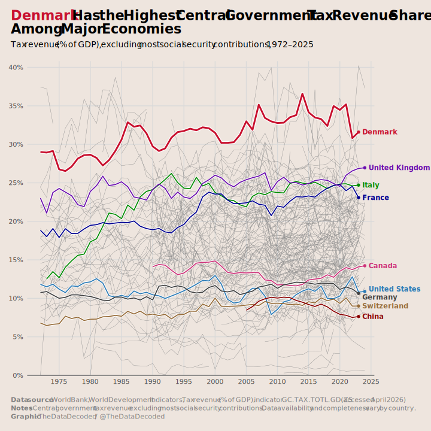

```{r project-path}
# Set project path
project_path <- file.path("visuals", "2026-04-denmark-tax-revenue")
```

```{r load-packages}

library(readr)
library(dplyr)
library(tidyr)
library(ggplot2)
library(ggtext)

```

```{r import-data}

tax_data <- read_csv(
    file.path(project_path, "data", "tax_revenue_share_of_gdp.csv"),
    na = c("..", ""),           # World Bank uses ".." for missing values
    n_max = 218,
    show_col_types = FALSE      # keeps the console clean
)

```


```{r data-preparation}

tax_data <- tax_data %>%
    rename_with(
        ~ gsub(" \\[YR[0-9]+\\]", "", .x),   # turns "1960 [YR1960]" → "1960"
        .cols = everything()
    )

tax_long <- tax_data %>%
    # Keep only the columns we actually need
    select(`Country Name`, `Country Code`, `1960`:`2025`) %>%
    
    # Pivot years into a proper "Year" column
    pivot_longer(
        cols = `1960`:`2025`,
        names_to = "Year",
        values_to = "tax_revenue_share_gdp"
    ) %>%
    
    # Make Year numeric so you can do calculations, filtering, plots, etc.
    mutate(Year = as.integer(Year)) %>% 
    # Rename columns
    rename(country_name = `Country Name`,
           country_code = `Country Code`) %>% 
    # Filter out wronly coded countries
    filter(! country_name %in% c("Timor-Leste", "Sudan", "Nauru"))

first_year <- tax_long %>%
    filter(!is.na(tax_revenue_share_gdp)) %>%     # keep only actual numbers
    summarise(first_year = min(Year, na.rm = TRUE))

tax_long <- tax_long %>% filter(Year >= as.numeric(first_year))

# high_countries <- c("Denmark", "Italy", "France", "United Kingdom")
# low_countries <- c("United States", "Canada", "Germany", "Switzerland")
test_country <- c("China")

country_colors <- c(
    "Denmark" = "#c8102e",
    "Italy" = "green4",
    "France" = "#000091",
    "United Kingdom" = "#6A0DAD",
    "United States" = "#2c7bb6",
    "Canada" = "violetred3",
    "Germany" = "grey25",
    "Switzerland" = "#966b38",
    "China" = "red4"
)

country_names <- sapply(names(country_colors),
                        function(m) tax_long %>%
                            filter(country_name %in% m & !is.na(tax_revenue_share_gdp)) %>%
                            last(na_rm = TRUE))

# Convert the list back to a matrix first, then to tibble
country_names <- country_names %>%          # replace with your actual object name
    unlist() %>% 
    matrix(nrow = 4, byrow = FALSE) %>%         # 4 variables (rows in the matrix)
    t() %>%                                     # transpose so each row = one country
    as_tibble()

# Add proper column names
colnames(country_names) <- c("country_name", "country_code", "Year", "tax_revenue_share_gdp")

# Optional: Convert types properly
country_names <- country_names %>%
    mutate(
        Year = as.integer(Year),
        tax_revenue_share_gdp = as.numeric(tax_revenue_share_gdp),
    ) %>% 
    mutate(tax_revenue_share_gdp = case_when(
        country_name == "United States" ~ 11.2,
        country_name == "Germany" ~ 10.15,
        .default = tax_revenue_share_gdp
    ))

linewidth <- c(0.8, 1.7, 1.4, 2.6)

```

```{r load-font}

library(sysfonts)

font_choice <- "Segoe UI"

font_add(font_choice,
         regular = "C:/Windows/Fonts/segoeui.ttf",
         bold = "C:/Windows/Fonts/segoeuib.ttf",
         italic = "C:/Windows/Fonts/segoeuii.ttf")

```

```{r line-chart}

tax_revenue_chart <- ggplot(data = tax_long ,
       aes(x = Year, y = tax_revenue_share_gdp, color = "grey20", group = country_name)) +
    geom_line(linewidth = 0.2, color = "grey55") +
    geom_line(data = tax_long %>% filter(country_name %in% names(country_colors)),
              color = "white", linewidth = linewidth[2]) +
    # geom_line(data = tax_long %>% filter(country_name %in% high_countries),
    #           color = "royalblue3", linewidth = linewidth[1]) +
    # geom_line(data = tax_long %>% filter(country_name %in% low_countries),
    #           color = "salmon3", linewidth = linewidth[1]) +
    # geom_line(data = tax_long %>% filter(country_name %in% test_country),
    #           color = "green4", linewidth = linewidth[1]) +
    geom_line(data = tax_long %>% filter(country_name %in% "Denmark"),
              color = "white", linewidth = linewidth[4]) +
    geom_line(data = tax_long %>% filter(country_name %in% "Denmark"),
              color = country_colors["Denmark"][[1]], linewidth = linewidth[3]) +
    geom_point(data = tax_long %>%
                   filter(country_name %in% "Denmark" & !is.na(tax_revenue_share_gdp)) %>%
                   last(na_rm = TRUE),
              color = country_colors["Denmark"][[1]], size = 1.7) +
    geom_line(data = tax_long %>% filter(country_name %in% "Italy"),
              color = country_colors["Italy"][[1]], linewidth = linewidth[1]) +
    geom_point(data = tax_long %>%
                   filter(country_name %in% "Italy" & !is.na(tax_revenue_share_gdp)) %>%
                   last(na_rm = TRUE),
               color = country_colors["Italy"][[1]], size = 1.7) +
    geom_line(data = tax_long %>% filter(country_name %in% "France"),
              color = country_colors["France"][[1]], linewidth = linewidth[1]) +
    geom_point(data = tax_long %>%
                   filter(country_name %in% "France" & !is.na(tax_revenue_share_gdp)) %>%
                   last(na_rm = TRUE),
               color = country_colors["France"][[1]], size = 1.7) +
    geom_line(data = tax_long %>% filter(country_name %in% "United Kingdom"),
              color = country_colors["United Kingdom"][[1]], linewidth = linewidth[1]) +
    geom_point(data = tax_long %>%
                   filter(country_name %in% "United Kingdom" & !is.na(tax_revenue_share_gdp)) %>%
                   last(na_rm = TRUE),
               color = country_colors["United Kingdom"][[1]], size = 1.7) +
    geom_line(data = tax_long %>% filter(country_name %in% "United States"),
              color = country_colors["United States"][[1]], linewidth = linewidth[1]) +
    geom_point(data = tax_long %>%
                   filter(country_name %in% "United States" & !is.na(tax_revenue_share_gdp)) %>%
                   last(na_rm = TRUE),
               color = country_colors["United States"][[1]], size = 1.7) +
    geom_line(data = tax_long %>% filter(country_name %in% "Canada"),
              color = country_colors["Canada"][[1]], linewidth = linewidth[1]) +
    geom_point(data = tax_long %>%
                   filter(country_name %in% "Canada" & !is.na(tax_revenue_share_gdp)) %>%
                   last(na_rm = TRUE),
               color = country_colors["Canada"][[1]], size = 1.7) +
    geom_line(data = tax_long %>% filter(country_name %in% "Germany"),
              color = country_colors["Germany"][[1]], linewidth = linewidth[1]) +
    geom_point(data = tax_long %>%
                   filter(country_name %in% "Germany" & !is.na(tax_revenue_share_gdp)) %>%
                   last(na_rm = TRUE),
               color = country_colors["Germany"][[1]], size = 1.7) +
    geom_line(data = tax_long %>% filter(country_name %in% "Switzerland"),
              color = country_colors["Switzerland"][[1]], linewidth = linewidth[1]) +
    geom_point(data = tax_long %>%
                   filter(country_name %in% "Switzerland" & !is.na(tax_revenue_share_gdp)) %>%
                   last(na_rm = TRUE),
               color = country_colors["Switzerland"][[1]], size = 1.7) +
    geom_text(data = country_names, aes(x = Year + 0.6, y = tax_revenue_share_gdp, label = country_name),
              color = country_colors, hjust = 0, size = 4, fontface = "bold") +
    geom_line(data = tax_long %>% filter(country_name %in% "China"),
              color = country_colors["China"][[1]], linewidth = linewidth[1]) +
    geom_point(data = tax_long %>%
                   filter(country_name %in% "China" & !is.na(tax_revenue_share_gdp)) %>%
                   last(na_rm = TRUE),
               color = country_colors["China"][[1]], size = 1.7) +

    
    geom_hline(yintercept = 0, color = "grey40") +
    scale_x_continuous(breaks = seq(1975, 2025, 5),
                       expand = expansion(mult = c(0.04, 0.01))) +
    scale_y_continuous(breaks = seq(0, 40, 5),
                       labels = scales::percent_format(scale = 1, accuracy = 1),
                       expand = expansion(mult = c(0, 0.02))) +
    coord_cartesian(clip = "off", ylim = c(0, 40)) +
    # ylim(0, 40) +
    labs(
        title = paste0("<span style='color: #c8102e;'>Denmark</span> Has the Highest Central Government Tax Revenue Share", "<br>", "Among Major Economies"),
        subtitle = paste("Tax revenue (% of GDP), excluding most social security contributions, 1972–2025"),
        caption = paste0("<b>Data source</b>: World Bank, World Development Indicators, Tax revenue (% of GDP), indicator GC.TAX.TOTL.GD.ZS (accessed April 2026)",
                         "<br>",
                         "<b>Notes</b>: Central government tax revenue excluding most social security contributions. Data availability and completeness vary by country.",
                         "<br>",
                         "<b>Graphic</b>: The Data Decoded / @TheDataDecoded")
    ) +
    theme_minimal(base_size = 14, base_family = font_choice) +
    theme(axis.title = element_blank(),
          panel.grid.minor = element_blank(),,
          panel.grid.major = element_line(color = "grey85"),
          plot.margin = margin(r = 95, b = 18, l = 18, t = 18, unit = "pt"),
          plot.background = element_rect(fill = "seashell2"),
          plot.title = element_markdown(hjust = 0, face = "bold", margin = margin(b = 5),
                                        lineheight = 1, size = rel(1.6)),
          plot.title.position = "plot",
          plot.caption.position = "plot",
          plot.caption = element_markdown(hjust = 0, vjust = 0, colour = "grey50",
                                          margin = margin(t = 20), lineheight = 1.25),
          plot.subtitle = element_markdown(hjust = 0, margin = margin(t = 3, b = 20),
                                           size = rel(1), lineheight = 1.2)
          )

```


```{r export-line-chart}

svg_path <- file.path(project_path, "plots", "thumb.svg")

svg_w <- 10
svg_h <- 10

png_w <- 2000
png_h <- round(png_w * svg_h / svg_w)  # keep same aspect ratio

ggsave(svg_path, tax_revenue_chart, width = svg_w, height = svg_h, bg = "white")

library(rsvg)

png_path <- file.path(project_path, "plots", "tax-revenue-line-chart.png")

rsvg_png(
    svg  = svg_path,
    file = png_path,
    width  = png_w,
    height = png_h
)

```


{width=100%}