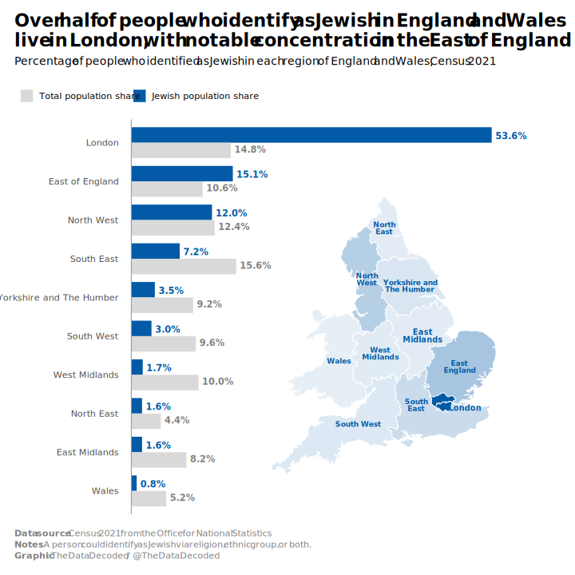
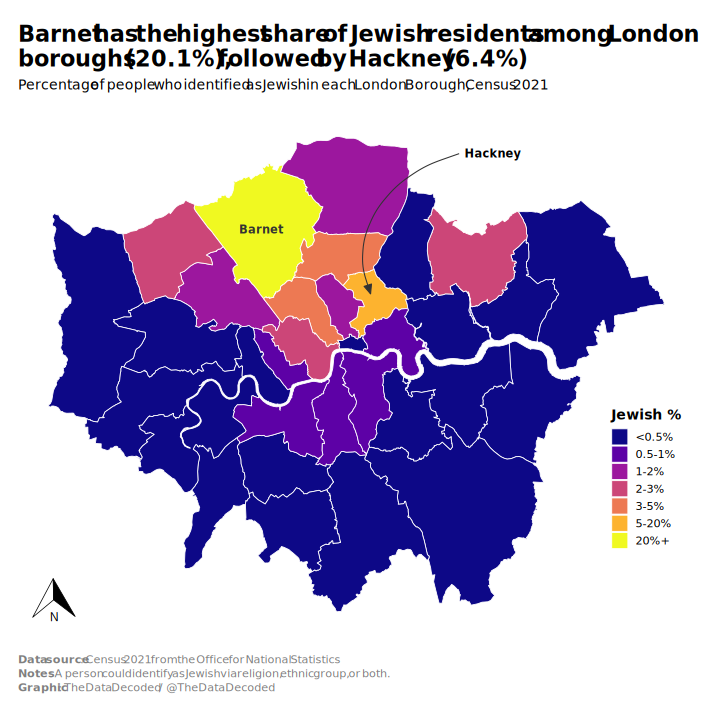
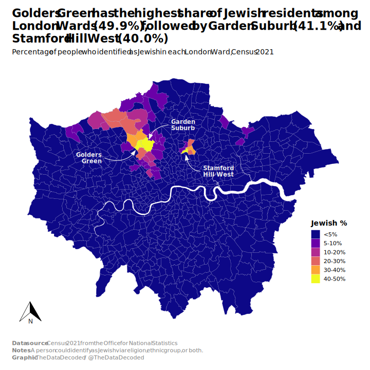

```{r project-path}
# Set project path
project_path <- file.path("visuals", "2026-05-03-england-wales-jews-geo")
```

```{r load-packages}

library(readxl)
library(janitor)
library(dplyr)
library(tidyr)
library(ggplot2)
library(ggtext)
library(scales)
library(forcats)
library(sf)
library(ggspatial)

```

```{r import-data}

# Define paths
data_dir <- file.path(project_path, "data")

excel_path_region <- file.path(data_dir, "jewish_population_by_region.xlsx")

excel_path_london <- file.path(data_dir, "jewish_population_by_london_borough.xlsx")

excel_path_london_wards <- file.path(data_dir, "nomis_2026_05_03_184617.xlsx")

regions_zip <- file.path(data_dir,
                         "Regions_December_2025_Boundaries_EN_BUC_6628912860252946105.zip")
countries_zip <- file.path(data_dir,
                           "Countries_December_2023_Boundaries_UK_BUC_9083552185220297502.zip")
london_boroughs_zip <- file.path(data_dir,
                                 "CTYUA_Dec_2015_GCB_in_England_and_Wales_2022_6353275090297102064.zip")
london_wards_zip <- file.path(data_dir,
                              "WD_MAY_2025_UK_BGC_V2_3260134346010774945.zip")


# 1. Download Excel only if it doesn't exist
if (!file.exists(excel_path_region)) {
  url <- "https://www.ons.gov.uk/visualisations/dvc2284/fig04/datadownload.xlsx"
  message("Downloading Excel data...")
  download.file(url, destfile = excel_path_region, mode = "wb")
} else {
  message("Excel data already exists — skipping download.")
}

# 2. Download Excel only if it doesn't exist
if (!file.exists(excel_path_london)) {
  url <- "https://www.ons.gov.uk/visualisations/dvc2284/fig06/datadownload.xlsx"
  message("Downloading Excel data...")
  download.file(url, destfile = excel_path_london, mode = "wb")
} else {
  message("Excel data already exists — skipping download.")
}

# 3. Unzip regions boundaries only if needed
regions_shp <- file.path(data_dir, "Regions_December_2025_EN_BUC.shp")  # adjust filename if needed

if (!file.exists(regions_shp)) {
  message("Unzipping Regions boundaries...")
  unzip(regions_zip, exdir = data_dir, junkpaths = TRUE)
} else {
  message("Regions boundaries already extracted — skipping unzip.")
}

# 4. Unzip countries boundaries only if needed
countries_shp <- file.path(data_dir, "Countries_December_2023_UK_BUC.shp")  # adjust if needed

if (!file.exists(countries_shp)) {
  message("Unzipping Countries boundaries...")
  unzip(countries_zip, exdir = data_dir, junkpaths = TRUE)
} else {
  message("Countries boundaries already extracted — skipping unzip.")
}

# 5. Unzip London boroughs boundaries only if needed
london_boroughs_shp <- file.path(data_dir, "CTYUA_Dec_2015_UGCB_in_England_and_Wales.shp") 

if (!file.exists(london_boroughs_shp)) {
  message("Unzipping Countries boundaries...")
  unzip(london_boroughs_zip, exdir = data_dir, junkpaths = TRUE)
} else {
  message("Countries boundaries already extracted — skipping unzip.")
}

# 6. Unzip London wards boundaries only if needed
london_wards_shp <- file.path(data_dir, "WD_MAY_2025_UK_BGC_V2.shp") 

if (!file.exists(london_wards_shp)) {
  message("Unzipping Countries boundaries...")
  unzip(london_wards_zip, exdir = data_dir, junkpaths = TRUE)
} else {
  message("Countries boundaries already extracted — skipping unzip.")
}

# Now read the data
jews_region <- read_excel(excel_path_region, sheet = 1, skip = 5)

jews_london_borough <- read_excel(excel_path_london, sheet = 1, skip = 6,
                          col_types = c("text", "text", "numeric", rep("skip", 3)))

london_data_wards <- read_excel(excel_path_london_wards, sheet = 1, skip = 9, col_names = FALSE)


england_regions <- st_read(file.path(project_path, "data", "RGN_DEC_2025_EN_BUC.shp")) %>%
  st_transform(27700) %>%
  rename(region_code = RGN25CD,
         region_name = RGN25NM) %>% 
  select(-RGN25NMW)

wales <- st_read(file.path(project_path, "data", "CTRY_DEC_2023_UK_BUC.shp")) %>%
  st_transform(27700) %>% 
  filter(CTRY23NM == "Wales") %>% 
  rename(region_code = CTRY23CD,
         region_name = CTRY23NM) %>% 
  select(-CTRY23NMW)

regions_full <- bind_rows(england_regions, wales)

london_boroughs <- st_read(file.path(project_path, "data", "CTYUA_Dec_2015_GCB_in_England_and_Wales.shp")) %>%
  st_transform(27700)

london_wards <- st_read(file.path(project_path, "data", "WD_MAY_2025_UK_BGC_V2.shp")) %>%
  st_transform(27700)

```

```{r prepare-data-regions}

jews_region <- jews_region %>% 
    clean_names() %>% 
    mutate(region_name = fct_reorder(region_name, jewish_identity_overall))

# Reshape data to long format for grouping
jews_region_long <- jews_region %>% 
    clean_names() %>% 
    mutate(region_name = fct_reorder(region_name, jewish_identity_overall)) %>%
  select(region_name, jewish_identity_overall, england_and_wales_population) %>%
  pivot_longer(cols = c(jewish_identity_overall, england_and_wales_population),
               names_to = "measure",
               values_to = "percentage") %>%
  mutate(measure = case_match(measure,
                      "jewish_identity_overall" ~ "Jewish population share",
                      "england_and_wales_population" ~ "Total population share",
                      .default = measure),
         measure = factor(measure, levels = c("Total population share", "Jewish population share"))
    )

map_data <- regions_full %>% 
  left_join(jews_region, by = "region_name") %>% 
  mutate(label = case_match(
    region_name,
    "London" ~ "London",
    "East of England" ~ "East\nEngland",
    "North West" ~ "North\nWest",
    "South East" ~ "South\nEast",
    "Yorkshire and The Humber" ~ "Yorkshire and\nThe Humber",
    "South West" ~ "South West",
    "West Midlands" ~ "West\nMidlands",
    "East Midlands" ~ "East\nMidlands",
    "North East" ~ "North\nEast",
    "Wales" ~ "Wales",
    .default = region_name
  ))

```

```{r set-font}

library(sysfonts)

font_choice <- "Segoe UI"

font_add(font_choice,
         regular = "C:/Windows/Fonts/segoeui.ttf",
         bold = "C:/Windows/Fonts/segoeuib.ttf",
         italic = "C:/Windows/Fonts/segoeuii.ttf")

```

```{r inset plot}

inset_map <- ggplot(map_data) +
  geom_sf(aes(fill = jewish_identity_overall),
          color = "white", linewidth = 0.4) +
  geom_sf_text(data = . %>% filter(!region_name %in% c("London", "East Midlands")),
               aes(label = label),   # or use abbreviations if too long
               size = 3.2, # adjust size
               fontface = "bold",
               color = "#035AA6",             # or "white" if dark areas
               check_overlap = FALSE,        # prevents overlapping labels
               lineheight = 0.8) +
  geom_sf_text(data = . %>% filter(region_name == "London"),
               aes(label = label),   # or use abbreviations if too long
               size = 3.4, # adjust size
               fontface = "bold",
               color = "#035AA6",             # or "white" if dark areas
               nudge_x = 65000,
               nudge_y = -12000,
               check_overlap = FALSE,        # prevents overlapping labels
               lineheight = 0.8) +
  geom_sf_text(data = . %>% filter(region_name == "East Midlands"),
               aes(label = label),   # or use abbreviations if too long
               size = 3.4, # adjust size
               fontface = "bold",
               color = "#035AA6",             # or "white" if dark areas
               nudge_x = -5000,
               nudge_y = 10000,
               check_overlap = FALSE,        # prevents overlapping labels
               lineheight = 0.8) +
  scale_fill_gradient(low = alpha("#035AA6", 0.1), 
                      high = "#035AA6",
                      labels = label_percent(scale = 1, accuracy = 0.1),
                      name = "Jewish %") +
  theme_void(base_size = 14, base_family = font_choice) +
  theme(legend.position = "none",
        plot.background = element_rect(fill = "transparent", colour = NA),
        panel.background = element_rect(fill = "transparent", colour = NA))

```


```{r main-plot}

region_bar <- ggplot(jews_region_long, aes(x = percentage, y = region_name, fill = measure)) +
    geom_col(width = 0.8, position = position_dodge(width = 0.8), stat = "identity") +
    geom_vline(xintercept = 0, color = "grey60", linetype = 1, linewidth = 0.5) +
    scale_x_continuous(breaks = seq(0, 60, 5),
                       labels = label_percent(scale = 1, accuracy = 1),
                       expand = expansion(mult = c(0.02, 0.02))) +
    scale_fill_manual(values = c("grey85", "#035AA6"),   # Jewish blue + grey
                    name = NULL) +
    coord_cartesian(clip = "off", xlim = c(0, 56)) +
    theme_minimal(base_size = 14, base_family = font_choice) +
    theme(axis.title = element_blank(),
          legend.position = "top",
          legend.justification = "left",
          legend.location = "plot",
          panel.grid.minor = element_blank(),
          panel.grid.major.y = element_blank(),
          panel.grid.major.x = element_blank(),
          axis.text.x = element_blank(),
          plot.margin = margin(r = 75, b = 18, l = 18, t = 18, unit = "pt"),
          plot.title = element_markdown(hjust = 0, face = "bold", margin = margin(b = 5),
                                        lineheight = 1.1, size = rel(1.6)),
          plot.title.position = "plot",
          plot.caption.position = "plot",
          plot.caption = element_markdown(hjust = 0, vjust = 0, colour = "grey50",
                                          margin = margin(t = 20), lineheight = 1.25),
          plot.subtitle = element_markdown(hjust = 0, margin = margin(t = 3, b = 20),
                                           size = rel(1), lineheight = 1.2)
    ) +
    labs(
        title = paste0("Over half of people who identify as Jewish in England and Wales",
                       "<br>",
                       "live in London, with notable concentration in the East of England"),
        subtitle = paste("Percentage of people who identified as Jewish in each region of England and Wales, Census 2021"),
        caption = paste0("<b>Data source</b>: Census 2021 from the Office for National Statistics",
                         "<br>",
                         "<b>Notes</b>: A person could identify as Jewish via religion, ethnic group, or both.",
                         "<br>",
                         "<b>Graphic</b>: The Data Decoded / @TheDataDecoded")
    ) +
    # Jewish
    geom_text(
              aes(x = percentage + signif(range(percentage)[2], 3) * 0.01,
                  y = region_name,
                  label = label_percent(scale = 1, accuracy = 0.1)(percentage),
                  color = measure, group = measure),
              position = position_dodge(width = 0.7),
              hjust = 0, size = 4, fontface = "bold") +
  
    scale_color_manual(values = c("Jewish population share" = "#035AA6", 
                              "Total population share" = "grey50"),
                   guide = "none") +

    annotation_custom(
            grob = ggplotGrob(inset_map),
            xmin = 15, xmax = 57,     # adjust these to your x-scale (percentages)
            ymin = 1,  ymax = 9       # adjust to your y-scale (region positions)
    )
  
```


```{r export-chart}

svg_path <- file.path(project_path, "plots", "thumb.svg")

svg_w <- 10
svg_h <- 10

png_w <- 3000
png_h <- round(png_w * svg_h / svg_w)  # keep same aspect ratio

ggsave(svg_path, region_bar, width = svg_w, height = svg_h, bg = "white")

library(rsvg)

png_path <- file.path(project_path, "plots", "jewish_share_by_region.png")

rsvg_png(
    svg  = svg_path,
    file = png_path,
    width  = png_w,
    height = png_h
)

```

{width=100%}


```{r prepare-data-borough}

london_borough_lookup <- tribble(
  ~LTLA_code,   ~borough_name,
  "E09000001",  "City of London",
  "E09000002",  "Barking and Dagenham",
  "E09000003",  "Barnet",
  "E09000004",  "Bexley",
  "E09000005",  "Brent",
  "E09000006",  "Bromley",
  "E09000007",  "Camden",
  "E09000008",  "Croydon",
  "E09000009",  "Ealing",
  "E09000010",  "Enfield",
  "E09000011",  "Greenwich",
  "E09000012",  "Hackney",
  "E09000013",  "Hammersmith and Fulham",
  "E09000014",  "Haringey",
  "E09000015",  "Harrow",
  "E09000016",  "Havering",
  "E09000017",  "Hillingdon",
  "E09000018",  "Hounslow",
  "E09000019",  "Islington",
  "E09000020",  "Kensington and Chelsea",
  "E09000021",  "Kingston upon Thames",
  "E09000022",  "Lambeth",
  "E09000023",  "Lewisham",
  "E09000024",  "Merton",
  "E09000025",  "Newham",
  "E09000026",  "Redbridge",
  "E09000027",  "Richmond upon Thames",
  "E09000028",  "Southwark",
  "E09000029",  "Sutton",
  "E09000030",  "Tower Hamlets",
  "E09000031",  "Waltham Forest",
  "E09000032",  "Wandsworth",
  "E09000033",  "Westminster"
)

jews_london_borough <- jews_london_borough %>% 
  clean_names() %>% 
  mutate(jewish_identity_overall = jewish_identity_overall * 100)

london_boroughs <- london_boroughs %>%
  left_join(london_borough_lookup, 
            by = c("ctyua15cd" = "LTLA_code"))

london_only <- london_boroughs %>%
  filter(!is.na(borough_name)) 

map_data_london <- london_only %>% 
  left_join(jews_london_borough, by = join_by("ctyua15cd" == "ltla_code")) %>% 
  mutate(jewish_bin = cut(jewish_identity_overall, 
                          breaks = c(0, 0.5, 1, 2, 3, 5, 20, 100),
                          labels = c("<0.5%", "0.5-1%", "1-2%", "2-3%", "3-5%", "5-20%", "20%+"),
                          include.lowest = TRUE))


```

```{r london-boroughs}

jews_borough_map <- ggplot(map_data_london) +
  geom_sf(aes(fill = jewish_bin),
          color = "white", linewidth = 0.4) +
  geom_sf_text(data = . %>% filter(ltla_name %in% c("Barnet")),
               aes(label = ltla_name),   # or use abbreviations if too long
               size = 4, # adjust size
               fontface = "bold",
               color = "grey20",             # or "white" if dark areas
               check_overlap = FALSE,        # prevents overlapping labels
               lineheight = 0.8) +
  scale_fill_viridis_d(
    option = "C",           # Blue-purple Viridis palette
    direction = 1,         # 1 = dark = higher values
    name = "Jewish %",
    labels = c("<0.5%", "0.5-1%", "1-2%", "2-3%", "3-5%", "5-20%", "20%+")
  ) +
  labs(
        title = paste0("Barnet has the highest share of Jewish residents among London ",
                       "<br>",
                       "boroughs (20.1%), followed by Hackney (6.4%)"),
        subtitle = paste("Percentage of people who identified as Jewish in each London Borough, Census 2021"),
        caption = paste0("<b>Data source</b>: Census 2021 from the Office for National Statistics",
                         "<br>",
                         "<b>Notes</b>: A person could identify as Jewish via religion, ethnic group, or both.",
                         "<br>",
                         "<b>Graphic</b>: The Data Decoded / @TheDataDecoded")
    ) +
  theme_void(base_size = 14, base_family = font_choice) +
  theme(legend.position = c(0.92, 0.3),
        legend.direction = "vertical",
        legend.justification = "center",
        legend.title = element_text(face = "bold"),
        plot.background = element_rect(fill = "white", colour = NA),
        panel.background = element_rect(fill = "white", colour = NA),
        plot.margin = margin(r = 25, b = 18, l = 18, t = 18, unit = "pt"),
          plot.title = element_markdown(hjust = 0, face = "bold", margin = margin(b = 5),
                                        lineheight = 1.1, size = rel(1.6)),
          plot.title.position = "plot",
          plot.caption.position = "plot",
          plot.caption = element_markdown(hjust = 0, vjust = 0, colour = "grey50",
                                          margin = margin(t = 20), lineheight = 1.25),
          plot.subtitle = element_markdown(hjust = 0, margin = margin(t = 3, b = 20),
                                           size = rel(1), lineheight = 1.2)) +
  geom_curve(data = tibble(x = 54.25e4, y = 19.93e4, xend = 53.41e4, yend = 18.6e4),
               aes(x = x, y = y, xend = xend, yend = yend),
               arrow = arrow(length = unit(0.35, "cm"), angle = 23, type = "closed"),
               color = "grey20",
               # size = 0.4,
               angle = 102,
               linewidth = 0.5,
               curvature = 0.5,
               inherit.aes = FALSE
    ) +
  annotate("text", x = 54.3e4, y = 19.93e4, label = "Hackney", hjust = 0, fontface = "bold",
           size = 4) +
  annotation_north_arrow(
  location = "bl",
  which_north = "true",
  pad_x = unit(0.2, "in"),
  pad_y = unit(0.2, "in"),
  style = north_arrow_orienteering()
)


```

```{r export-map-borough}

svg_path <- file.path(project_path, "plots", "jews_london_borough.svg")

svg_w <- 10
svg_h <- 10

png_w <- 3000
png_h <- round(png_w * svg_h / svg_w)  # keep same aspect ratio

ggsave(svg_path, jews_borough_map, width = svg_w, height = svg_h, bg = "white")

library(rsvg)

png_path <- file.path(project_path, "plots", "jews_london_borough.png")

rsvg_png(
    svg  = svg_path,
    file = png_path,
    width  = png_w,
    height = png_h
)

```

{width=100%}


```{r}

london_data_wards <- london_data_wards %>% 
    rename(ward = `...1`,
           ltla_code = `...2`,
           pop_all = `...3`,
           pop_all_share = `...4`,
           pop_jewish = `...5`,
           pop_jewish_share = `...6`) %>% 
  slice(1:(n() - 2)) %>% 
  mutate(ward = case_when(
    ward == "Bethnal Green" ~ "Bethnal Green East",
    ward == "St Peter's (Tower Hamlets)" ~ "Bethnal Green West",
    .default = ward)
  )

# Check mismatches
# ward_na <- london_data_wards %>%
#     right_join(london_wards_list, by = join_by("ward" == "ward_name")) %>% 
#     mutate(pop_jewish_total = sum(pop_jewish, na.rm = T),
#            pop_jewish_share_london = (pop_jewish / pop_jewish_total)*100) %>%
#   filter(is.na(ltla_code)) %>% 
#   select(ward, borough_name)

# london_data_wards %>% filter(str_starts(ward, "Mill Hill")) %>% print(n = Inf)

london_wards_list <- tribble(
  ~borough_name,                          ~ward_name,
  "Barking and Dagenham",                 "Abbey (Barking and Dagenham)",
  "Barking and Dagenham",                 "Alibon",
  "Barking and Dagenham",                 "Barking Riverside",
  "Barking and Dagenham",                 "Beam",
  "Barking and Dagenham",                 "Becontree",
  "Barking and Dagenham",                 "Chadwell Heath",
  "Barking and Dagenham",                 "Eastbrook & Rush Green",
  "Barking and Dagenham",                 "Eastbury",
  "Barking and Dagenham",                 "Gascoigne",
  "Barking and Dagenham",                 "Goresbrook",
  "Barking and Dagenham",                 "Heath (Barking and Dagenham)",
  "Barking and Dagenham",                 "Longbridge",
  "Barking and Dagenham",                 "Mayesbrook",
  "Barking and Dagenham",                 "Northbury",
  "Barking and Dagenham",                 "Parsloes",
  "Barking and Dagenham",                 "Thames View",
  "Barking and Dagenham",                 "Valence",
  "Barking and Dagenham",                 "Village (Barking and Dagenham)",
  "Barking and Dagenham",                 "Whalebone",
  
  "Barnet",                               "Barnet Vale",
  "Barnet",                               "Brunswick Park",
  "Barnet",                               "Burnt Oak",
  "Barnet",                               "Childs Hill",
  "Barnet",                               "Colindale North",
  "Barnet",                               "Colindale South",
  "Barnet",                               "Cricklewood",
  "Barnet",                               "East Barnet",
  "Barnet",                               "East Finchley",
  "Barnet",                               "Edgware (Barnet)",
  "Barnet",                               "Edgwarebury",
  "Barnet",                               "Finchley Church End",
  "Barnet",                               "Friern Barnet",
  "Barnet",                               "Garden Suburb",
  "Barnet",                               "Golders Green",
  "Barnet",                               "Hendon (Barnet)",
  "Barnet",                               "High Barnet",
  "Barnet",                               "Mill Hill (Barnet)",
  "Barnet",                               "Totteridge & Woodside",
  "Barnet",                               "Underhill",
  "Barnet",                               "West Finchley",
  "Barnet",                               "West Hendon",
  "Barnet",                               "Whetstone",
  "Barnet",                               "Woodhouse (Barnet)",
  
  "Bexley",                               "Barnehurst",
  "Bexley",                               "Belvedere",
  "Bexley",                               "Bexleyheath",
  "Bexley",                               "Blackfen & Lamorbey",
  "Bexley",                               "Blendon & Penhill",
  "Bexley",                               "Crayford",
  "Bexley",                               "Crook Log",
  "Bexley",                               "East Wickham",
  "Bexley",                               "Erith",
  "Bexley",                               "Falconwood & Welling",
  "Bexley",                               "Longlands",
  "Bexley",                               "Northumberland Heath",
  "Bexley",                               "Sidcup",
  "Bexley",                               "Slade Green & Northend",
  "Bexley",                               "St Mary's & St James (Bexley)",
  "Bexley",                               "Thamesmead East",
  "Bexley",                               "West Heath (Bexley)",
  
  "Brent",                                "Alperton",
  "Brent",                                "Barnhill",
  "Brent",                                "Brondesbury Park",
  "Brent",                                "Cricklewood & Mapesbury",
  "Brent",                                "Dollis Hill",
  "Brent",                                "Harlesden & Kensal Green",
  "Brent",                                "Kenton (Brent)",
  "Brent",                                "Kilburn (Brent)",
  "Brent",                                "Kingsbury (Brent)",
  "Brent",                                "Northwick Park",
  "Brent",                                "Preston (Brent)",
  "Brent",                                "Queensbury (Brent)",
  "Brent",                                "Queens Park (Brent)",
  "Brent",                                "Roundwood",
  "Brent",                                "Stonebridge",
  "Brent",                                "Sudbury",
  "Brent",                                "Tokyngton",
  "Brent",                                "Welsh Harp",
  "Brent",                                "Wembley Central",
  "Brent",                                "Wembley Hill",
  "Brent",                                "Wembley Park",
  "Brent",                                "Willesden Green",
  
  "Bromley",                              "Beckenham Town & Copers Cope",
  "Bromley",                              "Bickley & Sundridge",
  "Bromley",                              "Biggin Hill",
  "Bromley",                              "Bromley Common & Holwood",
  "Bromley",                              "Bromley Town",
  "Bromley",                              "Chelsfield",
  "Bromley",                              "Chislehurst",
  "Bromley",                              "Clock House",
  "Bromley",                              "Crystal Palace & Anerley",
  "Bromley",                              "Darwin",
  "Bromley",                              "Farnborough & Crofton",
  "Bromley",                              "Hayes & Coney Hall",
  "Bromley",                              "Kelsey & Eden Park",
  "Bromley",                              "Mottingham",
  "Bromley",                              "Orpington",
  "Bromley",                              "Penge & Cator",
  "Bromley",                              "Petts Wood & Knoll",
  "Bromley",                              "Plaistow",
  "Bromley",                              "Shortlands & Park Langley",
  "Bromley",                              "St Mary Cray",
  "Bromley",                              "St Paul's Cray",
  "Bromley",                              "West Wickham",
  
  "Camden",                               "Belsize",
  "Camden",                               "Bloomsbury",
  "Camden",                               "Camden Square",
  "Camden",                               "Camden Town",
  "Camden",                               "Fortune Green",
  "Camden",                               "Frognal",
  "Camden",                               "Gospel Oak",
  "Camden",                               "Hampstead Town",
  "Camden",                               "Haverstock",
  "Camden",                               "Highgate (Camden)",
  "Camden",                               "Holborn & Covent Garden",
  "Camden",                               "Kentish Town North",
  "Camden",                               "Kentish Town South",
  "Camden",                               "Kilburn (Camden)",
  "Camden",                               "King's Cross",
  "Camden",                               "Primrose Hill",
  "Camden",                               "Regent's Park (Camden)",
  "Camden",                               "South Hampstead",
  "Camden",                               "St Pancras & Somers Town",
  "Camden",                               "West Hampstead",
  
  "City of London",                       "City of London (Local Authority)",
  
  "City of Westminster",                  "Abbey Road",
  "City of Westminster",                  "Bayswater",
  "City of Westminster",                  "Church Street",
  "City of Westminster",                  "Harrow Road",
  "City of Westminster",                  "Hyde Park",
  "City of Westminster",                  "Knightsbridge & Belgravia",
  "City of Westminster",                  "Lancaster Gate",
  "City of Westminster",                  "Little Venice",
  "City of Westminster",                  "Maida Vale",
  "City of Westminster",                  "Marylebone",
  "City of Westminster",                  "Pimlico North",
  "City of Westminster",                  "Pimlico South",
  "City of Westminster",                  "Queen's Park (Westminster)",
  "City of Westminster",                  "Regent's Park (Westminster)",
  "City of Westminster",                  "St James's (Westminster)",
  "City of Westminster",                  "Vincent Square",
  "City of Westminster",                  "Westbourne (Westminster)",
  "City of Westminster",                  "West End (Westminster)",
  
  "Croydon",                              "Addiscombe East",
  "Croydon",                              "Addiscombe West",
  "Croydon",                              "Bensham Manor",
  "Croydon",                              "Broad Green",
  "Croydon",                              "Coulsdon Town",
  "Croydon",                              "Crystal Palace & Upper Norwood",
  "Croydon",                              "Fairfield (Croydon)",
  "Croydon",                              "Kenley",
  "Croydon",                              "New Addington North",
  "Croydon",                              "New Addington South",
  "Croydon",                              "Norbury Park",
  "Croydon",                              "Norbury & Pollards Hill",
  "Croydon",                              "Old Coulsdon",
  "Croydon",                              "Park Hill & Whitgift",
  "Croydon",                              "Purley Oaks & Riddlesdown",
  "Croydon",                              "Purley & Woodcote",
  "Croydon",                              "Sanderstead",
  "Croydon",                              "Selhurst",
  "Croydon",                              "Selsdon & Addington Village",
  "Croydon",                              "Selsdon Vale & Forestdale",
  "Croydon",                              "Shirley North",
  "Croydon",                              "Shirley South (Croydon)",
  "Croydon",                              "South Croydon",
  "Croydon",                              "South Norwood",
  "Croydon",                              "Thornton Heath",
  "Croydon",                              "Waddon",
  "Croydon",                              "West Thornton",
  "Croydon",                              "Woodside (Croydon)",
  
  "Ealing",                               "Central Greenford",
  "Ealing",                               "Dormers Wells",
  "Ealing",                               "Ealing Broadway",
  "Ealing",                               "Ealing Common",
  "Ealing",                               "East Acton",
  "Ealing",                               "Greenford Broadway",
  "Ealing",                               "Hanger Hill",
  "Ealing",                               "Hanwell Broadway",
  "Ealing",                               "Lady Margaret",
  "Ealing",                               "North Acton",
  "Ealing",                               "Northfield (Ealing)",
  "Ealing",                               "North Greenford",
  "Ealing",                               "North Hanwell",
  "Ealing",                               "Northolt Mandeville",
  "Ealing",                               "Northolt West End",
  "Ealing",                               "Norwood Green",
  "Ealing",                               "Perivale",
  "Ealing",                               "Pitshanger",
  "Ealing",                               "South Acton",
  "Ealing",                               "Southall Broadway",
  "Ealing",                               "Southall Green",
  "Ealing",                               "Southall West",
  "Ealing",                               "Southfield",
  "Ealing",                               "Walpole",
  
  "Enfield",                              "Arnos Grove",
  "Enfield",                              "Bowes",
  "Enfield",                              "Brimsdown",
  "Enfield",                              "Bullsmoor",
  "Enfield",                              "Bush Hill Park",
  "Enfield",                              "Carterhatch",
  "Enfield",                              "Cockfosters",
  "Enfield",                              "Edmonton Green",
  "Enfield",                              "Enfield Lock",
  "Enfield",                              "Grange Park",
  "Enfield",                              "Haselbury",
  "Enfield",                              "Highfield (Enfield)",
  "Enfield",                              "Jubilee (Enfield)",
  "Enfield",                              "Lower Edmonton",
  "Enfield",                              "New Southgate",
  "Enfield",                              "Oakwood (Enfield)",
  "Enfield",                              "Palmers Green",
  "Enfield",                              "Ponders End",
  "Enfield",                              "Ridgeway (Enfield)",
  "Enfield",                              "Southbury",
  "Enfield",                              "Southgate (Enfield)",
  "Enfield",                              "Town (Enfield)",
  "Enfield",                              "Upper Edmonton",
  "Enfield",                              "Whitewebbs",
  "Enfield",                              "Winchmore Hill",
  
  "Greenwich",                            "Abbey Wood",
  "Greenwich",                            "Blackheath Westcombe",
  "Greenwich",                            "Charlton Hornfair",
  "Greenwich",                            "Charlton Village & Riverside",
  "Greenwich",                            "East Greenwich",
  "Greenwich",                            "Eltham Page",
  "Greenwich",                            "Eltham Park & Progress",
  "Greenwich",                            "Eltham Town & Avery Hill",
  "Greenwich",                            "Greenwich Creekside",
  "Greenwich",                            "Greenwich Park",
  "Greenwich",                            "Greenwich Peninsula",
  "Greenwich",                            "Kidbrooke Park",
  "Greenwich",                            "Kidbrooke Village & Sutcliffe",
  "Greenwich",                            "Middle Park & Horn Park",
  "Greenwich",                            "Mottingham, Coldharbour & New Eltham",
  "Greenwich",                            "Plumstead Common",
  "Greenwich",                            "Plumstead & Glyndon",
  "Greenwich",                            "Shooters Hill",
  "Greenwich",                            "Thamesmead Moorings",
  "Greenwich",                            "West Thamesmead",
  "Greenwich",                            "Woolwich Arsenal",
  "Greenwich",                            "Woolwich Common",
  "Greenwich",                            "Woolwich Dockyard",
  
  "Hackney",                              "Brownswood",
  "Hackney",                              "Cazenove",
  "Hackney",                              "Clissold",
  "Hackney",                              "Dalston",
  "Hackney",                              "De Beauvoir",
  "Hackney",                              "Hackney Central",
  "Hackney",                              "Hackney Downs",
  "Hackney",                              "Hackney Wick",
  "Hackney",                              "Haggerston",
  "Hackney",                              "Homerton",
  "Hackney",                              "Hoxton East & Shoreditch",
  "Hackney",                              "Hoxton West",
  "Hackney",                              "King's Park",
  "Hackney",                              "Lea Bridge (Hackney)",
  "Hackney",                              "London Fields",
  "Hackney",                              "Shacklewell",
  "Hackney",                              "Springfield",
  "Hackney",                              "Stamford Hill West",
  "Hackney",                              "Stoke Newington",
  "Hackney",                              "Victoria (Hackney)",
  "Hackney",                              "Woodberry Down",
  
  "Hammersmith and Fulham",               "Addison",
  "Hammersmith and Fulham",               "Avonmore",
  "Hammersmith and Fulham",               "Brook Green",
  "Hammersmith and Fulham",               "College Park & Old Oak",
  "Hammersmith and Fulham",               "Coningham",
  "Hammersmith and Fulham",               "Fulham Reach",
  "Hammersmith and Fulham",               "Fulham Town",
  "Hammersmith and Fulham",               "Grove",
  "Hammersmith and Fulham",               "Hammersmith Broadway",
  "Hammersmith and Fulham",               "Lillie",
  "Hammersmith and Fulham",               "Munster",
  "Hammersmith and Fulham",               "Palace & Hurlingham",
  "Hammersmith and Fulham",               "Parsons Green & Sandford",
  "Hammersmith and Fulham",               "Ravenscourt",
  "Hammersmith and Fulham",               "Sands End",
  "Hammersmith and Fulham",               "Shepherd's Bush Green",
  "Hammersmith and Fulham",               "Walham Green",
  "Hammersmith and Fulham",               "Wendell Park",
  "Hammersmith and Fulham",               "West Kensington",
  "Hammersmith and Fulham",               "White City",
  "Hammersmith and Fulham",               "Wormholt",
  
  "Haringey",                             "Alexandra Park",
  "Haringey",                             "Bounds Green",
  "Haringey",                             "Bruce Castle",
  "Haringey",                             "Crouch End",
  "Haringey",                             "Fortis Green",
  "Haringey",                             "Harringay",
  "Haringey",                             "Hermitage & Gardens",
  "Haringey",                             "Highgate (Haringey)",
  "Haringey",                             "Hornsey",
  "Haringey",                             "Muswell Hill",
  "Haringey",                             "Noel Park",
  "Haringey",                             "Northumberland Park",
  "Haringey",                             "Seven Sisters",
  "Haringey",                             "South Tottenham",
  "Haringey",                             "St Ann's (Haringey)",
  "Haringey",                             "Stroud Green",
  "Haringey",                             "Tottenham Central",
  "Haringey",                             "Tottenham Hale",
  "Haringey",                             "West Green",
  "Haringey",                             "White Hart Lane",
  "Haringey",                             "Woodside (Haringey)",
  
  "Harrow",                               "Belmont (Harrow)",
  "Harrow",                               "Canons",
  "Harrow",                               "Centenary",
  "Harrow",                               "Edgware (Harrow)",
  "Harrow",                               "Greenhill (Harrow)",
  "Harrow",                               "Harrow on the Hill",
  "Harrow",                               "Harrow Weald",
  "Harrow",                               "Hatch End",
  "Harrow",                               "Headstone",
  "Harrow",                               "Kenton East",
  "Harrow",                               "Kenton West",
  "Harrow",                               "Marlborough",
  "Harrow",                               "North Harrow",
  "Harrow",                               "Pinner",
  "Harrow",                               "Pinner South",
  "Harrow",                               "Rayners Lane",
  "Harrow",                               "Roxbourne",
  "Harrow",                               "Roxeth",
  "Harrow",                               "Stanmore",
  "Harrow",                               "Wealdstone North",
  "Harrow",                               "Wealdstone South",
  "Harrow",                               "West Harrow",
  
  "Havering",                             "Beam Park",
  "Havering",                             "Cranham",
  "Havering",                             "Elm Park",
  "Havering",                             "Emerson Park",
  "Havering",                             "Gooshays",
  "Havering",                             "Hacton",
  "Havering",                             "Harold Wood",
  "Havering",                             "Havering-atte-Bower",
  "Havering",                             "Heaton (Havering)",
  "Havering",                             "Hylands & Harrow Lodge",
  "Havering",                             "Marshalls & Rise Park",
  "Havering",                             "Mawneys",
  "Havering",                             "Rainham & Wennington",
  "Havering",                             "Rush Green & Crowlands",
  "Havering",                             "South Hornchurch",
  "Havering",                             "Squirrels Heath",
  "Havering",                             "St Alban's",
  "Havering",                             "St Andrew's (Havering)",
  "Havering",                             "St Edward's",
  "Havering",                             "Upminster",
  
  "Hillingdon",                           "Belmore",
  "Hillingdon",                           "Charville",
  "Hillingdon",                           "Colham & Cowley",
  "Hillingdon",                           "Eastcote",
  "Hillingdon",                           "Harefield Village",
  "Hillingdon",                           "Hayes Town",
  "Hillingdon",                           "Heathrow Villages",
  "Hillingdon",                           "Hillingdon East",
  "Hillingdon",                           "Hillingdon West",
  "Hillingdon",                           "Ickenham & South Harefield",
  "Hillingdon",                           "Northwood (Hillingdon)",
  "Hillingdon",                           "Northwood Hills",
  "Hillingdon",                           "Pinkwell",
  "Hillingdon",                           "Ruislip",
  "Hillingdon",                           "Ruislip Manor",
  "Hillingdon",                           "South Ruislip",
  "Hillingdon",                           "Uxbridge",
  "Hillingdon",                           "West Drayton",
  "Hillingdon",                           "Wood End",
  "Hillingdon",                           "Yeading",
  "Hillingdon",                           "Yiewsley",
  
  "Hounslow",                             "Bedfont",
  "Hounslow",                             "Brentford East",
  "Hounslow",                             "Brentford West",
  "Hounslow",                             "Chiswick Gunnersbury",
  "Hounslow",                             "Chiswick Homefields",
  "Hounslow",                             "Chiswick Riverside",
  "Hounslow",                             "Cranford",
  "Hounslow",                             "Feltham North",
  "Hounslow",                             "Feltham West",
  "Hounslow",                             "Hanworth Park",
  "Hounslow",                             "Hanworth Village",
  "Hounslow",                             "Heston Central",
  "Hounslow",                             "Heston East",
  "Hounslow",                             "Heston West",
  "Hounslow",                             "Hounslow Central",
  "Hounslow",                             "Hounslow East",
  "Hounslow",                             "Hounslow Heath",
  "Hounslow",                             "Hounslow South",
  "Hounslow",                             "Hounslow West",
  "Hounslow",                             "Isleworth",
  "Hounslow",                             "Osterley & Spring Grove",
  "Hounslow",                             "Syon & Brentford Lock",
  
  "Islington",                            "Arsenal",
  "Islington",                            "Barnsbury",
  "Islington",                            "Bunhill",
  "Islington",                            "Caledonian",
  "Islington",                            "Canonbury",
  "Islington",                            "Clerkenwell",
  "Islington",                            "Finsbury Park",
  "Islington",                            "Highbury",
  "Islington",                            "Hillrise",
  "Islington",                            "Holloway",
  "Islington",                            "Junction",
  "Islington",                            "Laycock",
  "Islington",                            "Mildmay",
  "Islington",                            "St Mary's & St James' (Islington)",
  "Islington",                            "St Peter's & Canalside",
  "Islington",                            "Tollington",
  "Islington",                            "Tufnell Park",
  
  "Kensington and Chelsea",               "Abingdon",
  "Kensington and Chelsea",               "Brompton & Hans Town",
  "Kensington and Chelsea",               "Campden",
  "Kensington and Chelsea",               "Chelsea Riverside",
  "Kensington and Chelsea",               "Colville",
  "Kensington and Chelsea",               "Courtfield",
  "Kensington and Chelsea",               "Dalgarno",
  "Kensington and Chelsea",               "Earl's Court",
  "Kensington and Chelsea",               "Golborne",
  "Kensington and Chelsea",               "Holland",
  "Kensington and Chelsea",               "Norland",
  "Kensington and Chelsea",               "Notting Dale",
  "Kensington and Chelsea",               "Pembridge",
  "Kensington and Chelsea",               "Queen's Gate",
  "Kensington and Chelsea",               "Redcliffe",
  "Kensington and Chelsea",               "Royal Hospital",
  "Kensington and Chelsea",               "Stanley (Kensington and Chelsea)",
  "Kensington and Chelsea",               "St. Helen's (Kensington and Chelsea)",
  
  "Kingston upon Thames",                 "Alexandra (Kingston upon Thames)",
  "Kingston upon Thames",                 "Berrylands",
  "Kingston upon Thames",                 "Canbury Gardens",
  "Kingston upon Thames",                 "Chessington South & Malden Rushett",
  "Kingston upon Thames",                 "Coombe Hill",
  "Kingston upon Thames",                 "Coombe Vale",
  "Kingston upon Thames",                 "Green Lane & St James",
  "Kingston upon Thames",                 "Hook & Chessington North",
  "Kingston upon Thames",                 "King George's & Sunray",
  "Kingston upon Thames",                 "Kingston Gate",
  "Kingston upon Thames",                 "Kingston Town",
  "Kingston upon Thames",                 "Motspur Park & Old Malden East",
  "Kingston upon Thames",                 "New Malden Village",
  "Kingston upon Thames",                 "Norbiton",
  "Kingston upon Thames",                 "Old Malden",
  "Kingston upon Thames",                 "St Mark's & Seething Wells",
  "Kingston upon Thames",                 "Surbiton Hill",
  "Kingston upon Thames",                 "Tolworth",
  "Kingston upon Thames",                 "Tudor (Kingston upon Thames)",
  
  "Lambeth",                              "Brixton Acre Lane",
  "Lambeth",                              "Brixton North",
  "Lambeth",                              "Brixton Rush Common",
  "Lambeth",                              "Brixton Windrush",
  "Lambeth",                              "Clapham Common & Abbeville",
  "Lambeth",                              "Clapham East",
  "Lambeth",                              "Clapham Park",
  "Lambeth",                              "Clapham Town",
  "Lambeth",                              "Gipsy Hill",
  "Lambeth",                              "Herne Hill & Loughborough Junction",
  "Lambeth",                              "Kennington (Lambeth)",
  "Lambeth",                              "Knight's Hill",
  "Lambeth",                              "Myatt's Fields",
  "Lambeth",                              "Oval",
  "Lambeth",                              "St Martin's (Lambeth)",
  "Lambeth",                              "Stockwell East",
  "Lambeth",                              "Stockwell West & Larkhall",
  "Lambeth",                              "Streatham Common & Vale",
  "Lambeth",                              "Streatham Hill East",
  "Lambeth",                              "Streatham Hill West & Thornton",
  "Lambeth",                              "Streatham St Leonard's",
  "Lambeth",                              "Streatham Wells",
  "Lambeth",                              "Vauxhall (Lambeth)",
  "Lambeth",                              "Waterloo & South Bank",
  "Lambeth",                              "West Dulwich",
  
  "Lewisham",                             "Bellingham (Lewisham)",
  "Lewisham",                             "Blackheath (Lewisham)",
  "Lewisham",                             "Brockley",
  "Lewisham",                             "Catford South",
  "Lewisham",                             "Crofton Park",
  "Lewisham",                             "Deptford",
  "Lewisham",                             "Downham",
  "Lewisham",                             "Evelyn",
  "Lewisham",                             "Forest Hill",
  "Lewisham",                             "Grove Park",
  "Lewisham",                             "Hither Green",
  "Lewisham",                             "Ladywell",
  "Lewisham",                             "Lee Green",
  "Lewisham",                             "Lewisham Central",
  "Lewisham",                             "New Cross Gate",
  "Lewisham",                             "Perry Vale",
  "Lewisham",                             "Rushey Green",
  "Lewisham",                             "Sydenham",
  "Lewisham",                             "Telegraph Hill",
  
  "Merton",                               "Abbey (Merton)",
  "Merton",                               "Cannon Hill",
  "Merton",                               "Colliers Wood",
  "Merton",                               "Cricket Green",
  "Merton",                               "Figge's Marsh",
  "Merton",                               "Graveney",
  "Merton",                               "Hillside (Merton)",
  "Merton",                               "Lavender Fields",
  "Merton",                               "Longthornton",
  "Merton",                               "Lower Morden",
  "Merton",                               "Merton Park",
  "Merton",                               "Pollards Hill",
  "Merton",                               "Ravensbury",
  "Merton",                               "Raynes Park",
  "Merton",                               "St Helier",
  "Merton",                               "Village (Merton)",
  "Merton",                               "Wandle (Merton)",
  "Merton",                               "West Barnes",
  "Merton",                               "Wimbledon Park",
  "Merton",                               "Wimbledon Town & Dundonald",
  
  "Newham",                               "Beckton",
  "Newham",                               "Boleyn",
  "Newham",                               "Canning Town North",
  "Newham",                               "Canning Town South",
  "Newham",                               "Custom House",
  "Newham",                               "East Ham",
  "Newham",                               "East Ham South",
  "Newham",                               "Forest Gate North",
  "Newham",                               "Forest Gate South",
  "Newham",                               "Green Street East",
  "Newham",                               "Green Street West",
  "Newham",                               "Little Ilford",
  "Newham",                               "Manor Park (Newham)",
  "Newham",                               "Maryland",
  "Newham",                               "Plaistow North",
  "Newham",                               "Plaistow South",
  "Newham",                               "Plaistow West & Canning Town East",
  "Newham",                               "Plashet",
  "Newham",                               "Royal Albert",
  "Newham",                               "Royal Victoria",
  "Newham",                               "Stratford",
  "Newham",                               "Stratford Olympic Park",
  "Newham",                               "Wall End",
  "Newham",                               "West Ham",
  
  "Redbridge",                            "Aldborough",
  "Redbridge",                            "Barkingside",
  "Redbridge",                            "Bridge (Redbridge)",
  "Redbridge",                            "Chadwell",
  "Redbridge",                            "Churchfields",
  "Redbridge",                            "Clayhall",
  "Redbridge",                            "Clementswood",
  "Redbridge",                            "Cranbrook (Redbridge)",
  "Redbridge",                            "Fairlop",
  "Redbridge",                            "Fullwell",
  "Redbridge",                            "Goodmayes",
  "Redbridge",                            "Hainault",
  "Redbridge",                            "Ilford Town",
  "Redbridge",                            "Loxford",
  "Redbridge",                            "Mayfield",
  "Redbridge",                            "Monkhams",
  "Redbridge",                            "Newbury",
  "Redbridge",                            "Seven Kings",
  "Redbridge",                            "South Woodford",
  "Redbridge",                            "Valentines",
  "Redbridge",                            "Wanstead Park",
  "Redbridge",                            "Wanstead Village",
  
  "Richmond upon Thames",                 "Barnes (Richmond upon Thames)",
  "Richmond upon Thames",                 "East Sheen",
  "Richmond upon Thames",                 "Fulwell & Hampton Hill",
  "Richmond upon Thames",                 "Ham, Petersham & Richmond Riverside",
  "Richmond upon Thames",                 "Hampton (Richmond upon Thames)",
  "Richmond upon Thames",                 "Hampton North",
  "Richmond upon Thames",                 "Hampton Wick & South Teddington",
  "Richmond upon Thames",                 "Heathfield",
  "Richmond upon Thames",                 "Kew (Richmond upon Thames)",
  "Richmond upon Thames",                 "Mortlake & Barnes Common",
  "Richmond upon Thames",                 "North Richmond",
  "Richmond upon Thames",                 "South Richmond",
  "Richmond upon Thames",                 "South Twickenham",
  "Richmond upon Thames",                 "St Margarets & North Twickenham",
  "Richmond upon Thames",                 "Teddington",
  "Richmond upon Thames",                 "Twickenham Riverside",
  "Richmond upon Thames",                 "West Twickenham",
  "Richmond upon Thames",                 "Whitton (Richmond upon Thames)",
  
  "Southwark",                            "Borough & Bankside",
  "Southwark",                            "Camberwell Green",
  "Southwark",                            "Champion Hill",
  "Southwark",                            "Chaucer",
  "Southwark",                            "Dulwich Hill",
  "Southwark",                            "Dulwich Village",
  "Southwark",                            "Dulwich Wood",
  "Southwark",                            "Faraday",
  "Southwark",                            "Goose Green",
  "Southwark",                            "London Bridge & West Bermondsey",
  "Southwark",                            "Newington (Southwark)",
  "Southwark",                            "North Bermondsey",
  "Southwark",                            "North Walworth",
  "Southwark",                            "Nunhead & Queen's Road",
  "Southwark",                            "Old Kent Road",
  "Southwark",                            "Peckham",
  "Southwark",                            "Peckham Rye",
  "Southwark",                            "Rotherhithe",
  "Southwark",                            "Rye Lane",
  "Southwark",                            "South Bermondsey",
  "Southwark",                            "St George's (Southwark)",
  "Southwark",                            "St Giles",
  "Southwark",                            "Surrey Docks",
  
  "Sutton",                               "Beddington",
  "Sutton",                               "Belmont (Sutton)",
  "Sutton",                               "Carshalton Central",
  "Sutton",                               "Carshalton South & Clockhouse",
  "Sutton",                               "Cheam",
  "Sutton",                               "Hackbridge",
  "Sutton",                               "North Cheam",
  "Sutton",                               "South Beddington & Roundshaw",
  "Sutton",                               "St Helier East",
  "Sutton",                               "St Helier West",
  "Sutton",                               "Stonecot",
  "Sutton",                               "Sutton Central",
  "Sutton",                               "Sutton North",
  "Sutton",                               "Sutton South",
  "Sutton",                               "Sutton West & East Cheam",
  "Sutton",                               "The Wrythe",
  "Sutton",                               "Wallington North",
  "Sutton",                               "Wallington South",
  "Sutton",                               "Worcester Park North",
  "Sutton",                               "Worcester Park South",
  
  "Tower Hamlets",                        "Bethnal Green East",
  "Tower Hamlets",                        "Bethnal Green West",
  "Tower Hamlets",                        "Blackwall & Cubitt Town",
  "Tower Hamlets",                        "Bow East",
  "Tower Hamlets",                        "Bow West",
  "Tower Hamlets",                        "Bromley North",
  "Tower Hamlets",                        "Bromley South",
  "Tower Hamlets",                        "Canary Wharf",
  "Tower Hamlets",                        "Island Gardens",
  "Tower Hamlets",                        "Lansbury",
  "Tower Hamlets",                        "Limehouse",
  "Tower Hamlets",                        "Mile End (Tower Hamlets)",
  "Tower Hamlets",                        "Poplar (Tower Hamlets)",
  "Tower Hamlets",                        "Shadwell",
  "Tower Hamlets",                        "Spitalfields & Banglatown",
  "Tower Hamlets",                        "St Dunstan's",
  "Tower Hamlets",                        "Stepney Green",
  "Tower Hamlets",                        "St Katharine's & Wapping",
  "Tower Hamlets",                        "Weavers",
  "Tower Hamlets",                        "Whitechapel",
  
  "Waltham Forest",                       "Cann Hall (Waltham Forest)",
  "Waltham Forest",                       "Cathall",
  "Waltham Forest",                       "Chapel End",
  "Waltham Forest",                       "Chingford Green",
  "Waltham Forest",                       "Endlebury",
  "Waltham Forest",                       "Forest (Waltham Forest)",
  "Waltham Forest",                       "Grove Green",
  "Waltham Forest",                       "Hale End & Highams Park South",
  "Waltham Forest",                       "Hatch Lane & Highams Park North",
  "Waltham Forest",                       "Higham Hill",
  "Waltham Forest",                       "High Street (Waltham Forest)",
  "Waltham Forest",                       "Hoe Street",
  "Waltham Forest",                       "Larkswood",
  "Waltham Forest",                       "Lea Bridge (Waltham Forest)",
  "Waltham Forest",                       "Leyton",
  "Waltham Forest",                       "Leytonstone",
  "Waltham Forest",                       "Markhouse",
  "Waltham Forest",                       "St James (Waltham Forest)",
  "Waltham Forest",                       "Upper Walthamstow",
  "Waltham Forest",                       "Valley (Waltham Forest)",
  "Waltham Forest",                       "William Morris",
  "Waltham Forest",                       "Wood Street",
  
  "Wandsworth",                           "Balham",
  "Wandsworth",                           "Battersea Park",
  "Wandsworth",                           "East Putney",
  "Wandsworth",                           "Falconbrook",
  "Wandsworth",                           "Furzedown",
  "Wandsworth",                           "Lavender",
  "Wandsworth",                           "Nine Elms",
  "Wandsworth",                           "Northcote",
  "Wandsworth",                           "Roehampton",
  "Wandsworth",                           "Shaftesbury & Queenstown",
  "Wandsworth",                           "South Balham",
  "Wandsworth",                           "Southfields",
  "Wandsworth",                           "St Mary's (Wandsworth)",
  "Wandsworth",                           "Thamesfield",
  "Wandsworth",                           "Tooting Bec",
  "Wandsworth",                           "Tooting Broadway",
  "Wandsworth",                           "Trinity (Wandsworth)",
  "Wandsworth",                           "Wandle (Wandsworth)",
  "Wandsworth",                           "Wandsworth Common",
  "Wandsworth",                           "Wandsworth Town",
  "Wandsworth",                           "West Hill (Wandsworth)",
  "Wandsworth",                           "West Putney"
)

london_data_wards <- london_data_wards %>%
  right_join(london_wards_list, by = join_by("ward" == "ward_name"))
  # mutate(pop_jewish_total = sum(pop_jewish, na.rm = T),
  #        pop_jewish_share_london = (pop_jewish / pop_jewish_total)*100)

london_data_wards_ID <- london_data_wards %>%
  filter(!ltla_code == "n") %>% 
  pull(ltla_code)

london_data_wards_ID <- c(london_data_wards_ID,
                          london_wards %>% filter(LAD25NM == "City of London") %>% pull(WD25CD))

london_wards <- london_wards %>% 
  mutate(WD25NM = case_when(
    LAD25NM == "City of London" ~ "City of London (Local Authority)",
    .default = WD25NM
  ))

london_wards <- london_wards %>% 
  filter(WD25CD %in% london_data_wards_ID)

london_wards_city <- london_wards %>%
  mutate(
    geometry = if_else(
      LAD25NM == "City of London",
      st_union(geometry),           # merges all City of London wards
      geometry                      # keeps original for other wards
    )
  ) %>%
  # st_set_geometry("merged_geometry") %>%   # use the new merged column
  st_make_valid()

london_wards_city <- london_wards_city %>% 
    slice(25:n())

london_data_wards <- london_data_wards %>% 
  mutate(ltla_code = if_else(ltla_code == "n", "E05009312", ltla_code))

london_final <- london_wards_city %>%
  left_join(london_data_wards, by = c("WD25CD" = "ltla_code"))

# As share of each ward
london_final <- london_final %>% 
  mutate(jewish_bin = cut(pop_jewish_share, 
                          breaks = c(0, 5, 10, 20, 30, 40, 50),
                          labels = c("<5%", "5-10%", "10-20%", "20-30%", "30-40%", "40-50%"),
                          include.lowest = TRUE, right = FALSE))

```


```{r london-wards}

jews_ward_map <- ggplot(london_final) +
  geom_sf(aes(fill = jewish_bin),
          color = "white", linewidth = 0.085) +
  # coord_sf(
  #   xlim = c(500000, 560000),   # Easting (x)
  #   ylim = c(165000, 200000),   # Northing (y)
  #   expand = FALSE
  # ) +
  scale_fill_viridis_d(
    option = "C",           # Blue-purple Viridis palette
    direction = 1,         # 1 = dark = higher values
    name = "Jewish %",
    labels = c("<5%", "5-10%", "10-20%", "20-30%", "30-40%", "40-50%")
  ) +
  labs(
        title = paste0("Golders Green has the highest share of Jewish residents among",
                       "<br>",
                       "London Wards (49.9%), followed by Garden Suburb (41.1%) and",
                       "<br>",
                       "Stamford Hill West (40.0%)"),
        subtitle = paste("Percentage of people who identified as Jewish in each London Ward, Census 2021"),
        caption = paste0("<b>Data source</b>: Census 2021 from the Office for National Statistics",
                         "<br>",
                         "<b>Notes</b>: A person could identify as Jewish via religion, ethnic group, or both.",
                         "<br>",
                         "<b>Graphic</b>: The Data Decoded / @TheDataDecoded")
    ) +
  theme_void(base_size = 14, base_family = font_choice) +
  theme(legend.position = c(0.92, 0.3),
        legend.direction = "vertical",
        legend.justification = "center",
        legend.title = element_text(face = "bold"),
        plot.background = element_rect(fill = "transparent", colour = NA),
        panel.background = element_rect(fill = "transparent", colour = NA),
        plot.margin = margin(r = 25, b = 18, l = 18, t = 18, unit = "pt"),
          plot.title = element_markdown(hjust = 0, face = "bold", margin = margin(b = 5),
                                        lineheight = 1.1, size = rel(1.6)),
          plot.title.position = "plot",
          plot.caption.position = "plot",
          plot.caption = element_markdown(hjust = 0, vjust = 0, colour = "grey50",
                                          margin = margin(t = 20), lineheight = 1.25),
          plot.subtitle = element_markdown(hjust = 0, margin = margin(t = 3, b = 20),
                                           size = rel(1), lineheight = 1.2)) +
  geom_curve(data = tibble(x = 53.6e4, y = 18.35e4, xend = 53.33e4, yend = 18.65e4),
               aes(x = x, y = y, xend = xend, yend = yend),
               arrow = arrow(length = unit(0.35, "cm"), angle = 20, type = "closed"),
               color = "grey95",
               # size = 0.4,
               angle = 102,
               linewidth = 0.5,
               curvature = -0.4,
               inherit.aes = FALSE
    ) +
  annotate("text", x = 53.95e4, y = 18.35e4, label = "Stamford\nHill West", fontface = "bold",
           size = 4, color = "grey95", lineheight = 0.9) +
  
  geom_curve(data = tibble(x = 51.8e4, y = 18.6e4, xend = 52.38e4, yend = 18.74e4),
               aes(x = x, y = y, xend = xend, yend = yend),
               arrow = arrow(length = unit(0.35, "cm"), angle = 20, type = "closed"),
               color = "grey95",
               # size = 0.4,
               angle = 102,
               linewidth = 0.5,
               curvature = 0.4,
               inherit.aes = FALSE
    ) +
  annotate("text", x = 51.78e4, y = 18.6e4, label = "Golders\nGreen", fontface = "bold",
           size = 4, color = "grey95", lineheight = 0.9, hjust = 1) +
  
  geom_curve(data = tibble(x = 53e4, y = 19.22e4, xend = 52.64e4, yend = 18.956e4),
               aes(x = x, y = y, xend = xend, yend = yend),
               arrow = arrow(length = unit(0.35, "cm"), angle = 20, type = "closed"),
               color = "grey95",
               # size = 0.4,
               angle = 102,
               linewidth = 0.5,
               curvature = 0.33,
               inherit.aes = FALSE
    ) +
  annotate("text", x = 53.05e4, y = 19.22e4, label = "Garden\nSuburb", fontface = "bold",
           size = 4, color = "grey95", lineheight = 0.9, hjust = 0) +
  annotation_north_arrow(
  location = "bl",
  which_north = "true",
  pad_x = unit(0.2, "in"),
  pad_y = unit(0.2, "in"),
  style = north_arrow_orienteering()
)

```

```{r export-map-ward}

svg_path <- file.path(project_path, "plots", "jews_london_ward.svg")

svg_w <- 10
svg_h <- 10

png_w <- 3000
png_h <- round(png_w * svg_h / svg_w)  # keep same aspect ratio

ggsave(svg_path, jews_ward_map, width = svg_w, height = svg_h, bg = "white")

library(rsvg)

png_path <- file.path(project_path, "plots", "jews_london_ward.png")

rsvg_png(
    svg  = svg_path,
    file = png_path,
    width  = png_w,
    height = png_h
)

```

{width=100%}