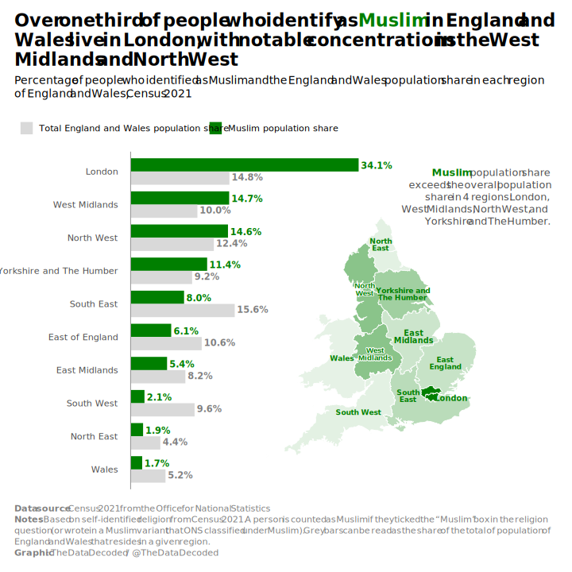
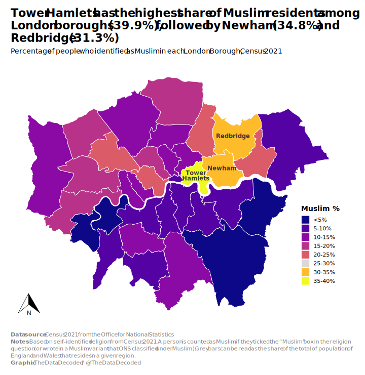

```{r project-path}
# Set project path
project_path <- file.path("visuals", "2026-05-england-wales-muslims-geo")
```

```{r load-packages}

library(readxl)
library(janitor)
library(dplyr)
library(tidyr)
library(ggplot2)
library(ggtext)
library(sf)
library(forcats)
library(scales)
library(shadowtext)
library(ggspatial)
library(viridis)

```

```{r import-data-region}

data_dir <- file.path(project_path, "data")

excel_path_region <- file.path(data_dir, "TS030-2021-3-filtered-2026-05-04T21_44_03Z.xlsx")

religions_region <- read_excel(excel_path_region, sheet = 1)

regions_zip <- file.path(data_dir,
                         "Regions_December_2025_Boundaries_EN_BUC_6628912860252946105.zip")

countries_zip <- file.path(data_dir,
                           "Countries_December_2023_Boundaries_UK_BUC_9083552185220297502.zip")

# 1. Unzip regions boundaries only if needed
regions_shp <- file.path(data_dir, "RGN_DEC_2025_EN_BUC.shp")  # adjust filename if needed

if (!file.exists(regions_shp)) {
  message("Unzipping Regions boundaries...")
  unzip(regions_zip, exdir = data_dir, junkpaths = TRUE)
} else {
  message("Regions boundaries already extracted — skipping unzip.")
}

# 2. Unzip countries boundaries only if needed
countries_shp <- file.path(data_dir, "CTRY_DEC_2023_UK_BUC.shp")  # adjust if needed

if (!file.exists(countries_shp)) {
  message("Unzipping Countries boundaries...")
  unzip(countries_zip, exdir = data_dir, junkpaths = TRUE)
} else {
  message("Countries boundaries already extracted — skipping unzip.")
}

england_regions <- st_read(file.path(project_path, "data", "RGN_DEC_2025_EN_BUC.shp")) %>%
  st_transform(27700) %>%
  rename(region_code = RGN25CD,
         region_name = RGN25NM) %>% 
  select(-RGN25NMW)

wales <- st_read(file.path(project_path, "data", "CTRY_DEC_2023_UK_BUC.shp")) %>%
  st_transform(27700) %>% 
  filter(CTRY23NM == "Wales") %>% 
  rename(region_code = CTRY23CD,
         region_name = CTRY23NM) %>% 
  select(-CTRY23NMW)

regions_full <- bind_rows(england_regions, wales)

```

```{r prepare-data-region}

religions_region <- religions_region %>% 
    clean_names() %>% 
    rename(region_name = regions)

muslims_region <- religions_region %>%
    filter(religion_10_categories == "Muslim") %>%
    select(-c(religion_10_categories_code, religion_10_categories)) %>% 
    rename(muslim_identity = observation) %>% 
    mutate(region_name = fct_reorder(region_name, muslim_identity))

total_region <- religions_region %>% 
    group_by(region_name) %>% 
    summarise(total_population_region = sum(observation))

muslims_region <- muslims_region %>% 
    left_join(total_region, by = "region_name") %>% 
    mutate(total_muslim_population = sum(muslim_identity),
           muslim_share = (muslim_identity / total_muslim_population)*100,
           total_population = sum(total_population_region),
           total_population_share = (total_population_region / total_population)*100) %>% 
    select(-c(total_muslim_population, total_population))

# Reshape data to long format for grouping
muslims_region_long <- muslims_region %>% 
    mutate(region_name = fct_reorder(region_name, muslim_identity)) %>%
    select(region_name, muslim_share, total_population_share) %>% 
    pivot_longer(cols = c(muslim_share, total_population_share),
                 names_to = "measure",
                 values_to = "percentage") %>%
    mutate(measure = case_match(measure,
                      "muslim_share" ~ "Muslim population share",
                      "total_population_share" ~ "Total England and Wales population share",
                      .default = measure),
           measure = factor(measure, levels = c("Total England and Wales population share",
                                                "Muslim population share"))
    )
    
map_data <- regions_full %>% 
  left_join(muslims_region, by = "region_name") %>% 
  mutate(label = case_match(
    region_name,
    "London" ~ "London",
    "East of England" ~ "East\nEngland",
    "North West" ~ "North\nWest",
    "South East" ~ "South\nEast",
    "Yorkshire and The Humber" ~ "Yorkshire and\nThe Humber",
    "South West" ~ "South West",
    "West Midlands" ~ "West\nMidlands",
    "East Midlands" ~ "East\nMidlands",
    "North East" ~ "North\nEast",
    "Wales" ~ "Wales",
    .default = region_name
  ))

```


```{r set-font}

library(sysfonts)

font_choice <- "Segoe UI"

font_add(font_choice,
         regular = "C:/Windows/Fonts/segoeui.ttf",
         bold = "C:/Windows/Fonts/segoeuib.ttf",
         italic = "C:/Windows/Fonts/segoeuii.ttf")

```

```{r inset plot}

inset_map <- ggplot(map_data) +
  geom_sf(aes(fill = muslim_share),
          color = "white", linewidth = 0.4) +
  geom_shadowtext(
    data = map_data %>% 
           filter(region_name %in% c("North West", "West Midlands")) %>% 
           st_centroid(),                    # ← This is the key
    aes(label = label, 
        geometry = geometry),                # still need geometry for sf
    stat = "sf_coordinates",                 # extracts x/y from geometry
    size = 3.45,
    fontface = "bold",
    colour = "#007f00",                    # main text color
    bg.colour = "white",                     # white glow
    bg.r = 0.12,                             # glow strength (adjust)
    lineheight = 0.8,
    check_overlap = FALSE
  ) +
  geom_sf_text(data = . %>% filter(!region_name %in% c("London", "East Midlands", "North West", "West Midlands")),
               aes(label = label),   # or use abbreviations if too long
               size = 3.2, # adjust size
               fontface = "bold",
               color = "#007f00",             # or "white" if dark areas
               check_overlap = FALSE,        # prevents overlapping labels
               lineheight = 0.8) +
  geom_sf_text(data = . %>% filter(region_name == "London"),
               aes(label = label),   # or use abbreviations if too long
               size = 3.4, # adjust size
               fontface = "bold",
               color = "#007f00",             # or "white" if dark areas
               nudge_x = 69000,
               nudge_y = -12000,
               check_overlap = FALSE,        # prevents overlapping labels
               lineheight = 0.8) +
  geom_sf_text(data = . %>% filter(region_name == "East Midlands"),
               aes(label = label),   # or use abbreviations if too long
               size = 3.4, # adjust size
               fontface = "bold",
               color = "#007f00",             # or "white" if dark areas
               nudge_x = -5000,
               nudge_y = 10000,
               check_overlap = FALSE,        # prevents overlapping labels
               lineheight = 0.8) +
  scale_fill_gradient(low = alpha("#007f00", 0.1), 
                      high = "#007f00",
                      labels = label_percent(scale = 1, accuracy = 0.1),
                      name = "Muslim %") +
  theme_void(base_size = 14, base_family = font_choice) +
  theme(legend.position = "none",
        plot.background = element_rect(fill = "transparent", colour = NA),
        panel.background = element_rect(fill = "transparent", colour = NA))


```


```{r main-plot}

region_bar <- ggplot(muslims_region_long, aes(x = percentage, y = region_name, fill = measure)) +
    geom_col(width = 0.8, position = position_dodge(width = 0.8), stat = "identity") +
    geom_vline(xintercept = 0, color = "grey60", linetype = 1, linewidth = 0.5) +
    scale_x_continuous(breaks = seq(0, 60, 5),
                       labels = label_percent(scale = 1, accuracy = 1),
                       expand = expansion(mult = c(0.02, 0.02))) +
    scale_fill_manual(values = c("grey85", "#007f00"),   # Jewish blue + grey
                    name = NULL) +
    coord_cartesian(clip = "off", xlim = c(0, 56)) +
    theme_minimal(base_size = 14, base_family = font_choice) +
    theme(axis.title = element_blank(),
          legend.position = "top",
          legend.justification = "left",
          legend.location = "plot",
          panel.grid.minor = element_blank(),
          panel.grid.major.y = element_blank(),
          panel.grid.major.x = element_blank(),
          axis.text.x = element_blank(),
          plot.margin = margin(r = 75, b = 18, l = 18, t = 18, unit = "pt"),
          plot.title = element_markdown(hjust = 0, face = "bold", margin = margin(b = 5),
                                        lineheight = 1.1, size = rel(1.6)),
          plot.title.position = "plot",
          plot.caption.position = "plot",
          plot.caption = element_markdown(hjust = 0, vjust = 0, colour = "grey50",
                                          margin = margin(t = 20), lineheight = 1.25),
          plot.subtitle = element_markdown(hjust = 0, margin = margin(t = 3, b = 20),
                                           size = rel(1), lineheight = 1.2)
    ) +
    labs(
        title = paste0("Over one third of people who identify as <span style='color: #007f00;'>Muslim</span> in England and",
                       "<br>",
                       "Wales live in London, with notable concentrations in the West",
                       "<br>",
                       "Midlands and North West"),
        subtitle = paste("Percentage of people who identified as Muslim and the England and Wales population share in each region",
                         "<br>",
                         "of England and Wales, Census 2021"),
        caption = paste0("<b>Data source</b>: Census 2021 from the Office for National Statistics",
                         "<br>",
                         "<b>Notes</b>: Based on self-identified religion from Census 2021. A person is counted as Muslim if they ticked the “Muslim” box in the religion",
                         "<br>",
                         "question (or wrote in a Muslim variant that ONS classified under Muslim). Grey bars can be read as the share of the total of population of",
                         "<br>",
                         "England and Wales that resides in a given region.",
                         "<br>",
                         "<b>Graphic</b>: The Data Decoded / @TheDataDecoded")
    ) +

    geom_text(
              aes(x = percentage + signif(range(percentage)[2], 3) * 0.01,
                  y = region_name,
                  label = label_percent(scale = 1, accuracy = 0.1)(percentage),
                  color = measure, group = measure),
              position = position_dodge(width = 0.7),
              hjust = 0, size = 4, fontface = "bold") +
  
    scale_color_manual(values = c("Muslim population share" = "#007f00", 
                              "Total England and Wales population share" = "grey50"),
                   guide = "none") +
    annotate("richtext", x = 62.5, y = 9.2,
             label = paste0("<span style='color: #007f00;'>**Muslim**</span> population share",
                            "<br>",
                            "exceeds the overall population",
                            "<br>",
                            "share in 4 regions: London,",
                            "<br>",
                            "West Midlands, North West, and",
                            "<br>",
                            "Yorkshire and The Humber."),
             fill = NA, label.color = NA, # Removes background box
             hjust = 1, color = "grey30", family = font_choice, size = 4.5) +

    annotation_custom(
            grob = ggplotGrob(inset_map),
            xmin = 15, xmax = 57,     # adjust these to your x-scale (percentages)
            ymin = 1,  ymax = 9       # adjust to your y-scale (region positions)
    )
  
```


```{r export-chart}

svg_path <- file.path(project_path, "plots", "thumb.svg")

svg_w <- 10
svg_h <- 10

png_w <- 3000
png_h <- round(png_w * svg_h / svg_w)  # keep same aspect ratio

ggsave(svg_path, region_bar, width = svg_w, height = svg_h, bg = "white")

library(rsvg)

png_path <- file.path(project_path, "plots", "muslim_share_by_region.png")

rsvg_png(
    svg  = svg_path,
    file = png_path,
    width  = png_w,
    height = png_h
)

```

{width=100%}


```{r import-data-borough}

##################
# Data on Muslims

excel_path_borough <- file.path(data_dir, "TS030-2021-3-filtered-2026-05-05T21_28_24Z.xlsx")

religions_borough <- read_excel(excel_path_borough, sheet = 1)

########################
# Boundaries of Boroughs

london_boroughs_zip <- file.path(data_dir,
                                 "CTYUA_Dec_2015_GCB_in_England_and_Wales_2022_6353275090297102064.zip")

# 5. Unzip London boroughs boundaries only if needed
london_boroughs_shp <- file.path(data_dir, "CTYUA_Dec_2015_GCB_in_England_and_Wales.shp") 

if (!file.exists(london_boroughs_shp)) {
  message("Unzipping Countries boundaries...")
  unzip(london_boroughs_zip, exdir = data_dir, junkpaths = TRUE)
} else {
  message("Countries boundaries already extracted — skipping unzip.")
}

london_boroughs <- st_read(file.path(project_path, "data",
                                     "CTYUA_Dec_2015_GCB_in_England_and_Wales.shp")) %>%
  st_transform(27700)


```

```{r prepare-data-borough}

london_borough_lookup <- tribble(
  ~LTLA_code,   ~borough_name,
  "E09000001",  "City of London",
  "E09000002",  "Barking and Dagenham",
  "E09000003",  "Barnet",
  "E09000004",  "Bexley",
  "E09000005",  "Brent",
  "E09000006",  "Bromley",
  "E09000007",  "Camden",
  "E09000008",  "Croydon",
  "E09000009",  "Ealing",
  "E09000010",  "Enfield",
  "E09000011",  "Greenwich",
  "E09000012",  "Hackney",
  "E09000013",  "Hammersmith and Fulham",
  "E09000014",  "Haringey",
  "E09000015",  "Harrow",
  "E09000016",  "Havering",
  "E09000017",  "Hillingdon",
  "E09000018",  "Hounslow",
  "E09000019",  "Islington",
  "E09000020",  "Kensington and Chelsea",
  "E09000021",  "Kingston upon Thames",
  "E09000022",  "Lambeth",
  "E09000023",  "Lewisham",
  "E09000024",  "Merton",
  "E09000025",  "Newham",
  "E09000026",  "Redbridge",
  "E09000027",  "Richmond upon Thames",
  "E09000028",  "Southwark",
  "E09000029",  "Sutton",
  "E09000030",  "Tower Hamlets",
  "E09000031",  "Waltham Forest",
  "E09000032",  "Wandsworth",
  "E09000033",  "Westminster"
)

# muslims_london_borough <- religions_borough %>% 
#   clean_names() %>% 
#   mutate(jewish_identity_overall = jewish_identity_overall * 100)

religions_borough <- religions_borough %>% 
    clean_names() %>% 
    rename(ltla_code = lower_tier_local_authorities_code,
           ltla = lower_tier_local_authorities)

muslims_borough <- religions_borough %>% 
    filter(religion_10_categories == "Muslim") %>%
    select(-c(religion_10_categories_code, religion_10_categories)) %>% 
    rename(muslim_identity = observation) %>% 
    mutate(ltla = fct_reorder(ltla, muslim_identity))

total_borough <- religions_borough %>% 
    group_by(ltla) %>% 
    summarise(total_population_borough = sum(observation))

muslims_borough <- muslims_borough %>% 
    left_join(total_borough, by = "ltla") %>% 
    mutate(muslim_share = (muslim_identity / total_population_borough)*100) %>% 
    arrange(desc(muslim_share)) %>% 
    select(-c(total_population_borough, muslim_identity))
    
    # mutate(total_muslim_population = sum(muslim_identity),
    #        muslim_share = (muslim_identity / total_muslim_population)*100,
    #        total_population = sum(total_population_borough),
    #        total_population_share = (total_population_borough / total_population)*100) %>% 
    # select(-c(total_muslim_population, total_population))

london_boroughs <- london_boroughs %>%
  left_join(london_borough_lookup, 
            by = c("ctyua15cd" = "LTLA_code"))

london_only <- london_boroughs %>%
  filter(!is.na(borough_name)) 


map_data_london <- london_only %>% 
  left_join(muslims_borough, by = join_by("ctyua15cd" == "ltla_code")) %>% 
  mutate(muslim_bin = cut(
      muslim_share,
      breaks = c(0, 5, 10, 15, 20, 25, 30, 35, Inf),   # ← added Inf
      labels = c("<5%", "5-10%", "10-15%", "15-20%", "20-25%", 
                 "25-30%", "30-35%", "35-40%"),     # ← fixed labels
      include.lowest = TRUE,
      right = TRUE                                        # explicit is clearer
    ) %>% 
        factor(levels = c("<5%", "5-10%", "10-15%", "15-20%", "20-25%", 
                        "25-30%", "30-35%", "35-40%")),
    muslim_share = round(muslim_share, 1),
    borough_labels = case_when(
        ltla == "Tower Hamlets" ~ "Tower\nHamlets",
        .default = ltla
    ))

# Create dummy row properly
dummy_row <- map_data_london[1, ] %>% 
  mutate(
    muslim_bin = "25-30%",
    muslim_share = 27.5,
    ctyua15nm = "Dummy (for legend)",
    borough_name = "Dummy (for legend)"
    # All other columns will be carried over from the first row
  )

# Now bind and fix factor
map_data_london <- map_data_london %>%
  bind_rows(dummy_row) %>%
  mutate(
    muslim_bin = factor(muslim_bin, 
                        levels = c("<5%", "5-10%", "10-15%", "15-20%", "20-25%", 
                                   "25-30%", "30-35%", "35-40%"))
  )
    
# map_data_london %>% select(borough_name, muslim_share) %>% arrange(desc(muslim_share))

viridis_cols <- viridis::viridis(n = 8, option = "C", direction = 1)

custom_colors <- c(
  viridis_cols[1:5],     # <5% to 20-25%
  "grey85",             # ← 25-30% = Grey
  viridis_cols[7:8]     # 30-35%, 35-40%
)[1:8]                   # take exactly 8 colors

# Calculate label positions (centroids)
label_data <- map_data_london %>%
  st_centroid() %>%                            # get center point of each borough
  mutate(
    label_x = st_coordinates(geometry)[,1],    # extract X coordinate
    label_y = st_coordinates(geometry)[,2]     # extract Y coordinate
  )
  

```

```{r london-boroughs-chart}

muslims_borough_map <- ggplot(map_data_london) +
  geom_sf(data = . %>% filter(borough_name == "Dummy (for legend)"),
          aes(fill = muslim_bin),
          color = "white", linewidth = 0.4) +
  geom_sf(data = . %>% filter(borough_name != "Dummy (for legend)"),
          aes(fill = muslim_bin),
          color = "white", linewidth = 0.4) +
  geom_sf_text(data = . %>% filter(ltla %in% c("Redbridge")),
               aes(label = borough_labels),   # or use abbreviations if too long
               size = 4, # adjust size
               fontface = "bold",
               color = "grey20",             # or "white" if dark areas
               check_overlap = FALSE,        # prevents overlapping labels
               lineheight = 0.8) +
    geom_sf_text(data = . %>% filter(ltla %in% c("Newham")),
               aes(label = borough_labels),   # or use abbreviations if too long
               size = 4, # adjust size
               fontface = "bold",
               color = "grey20",             # or "white" if dark areas
               check_overlap = FALSE,        # prevents overlapping labels
               lineheight = 0.8,
               hjust = 0.37) +
    geom_sf_text(data = . %>% filter(ltla %in% c("Tower Hamlets")),
               aes(label = borough_labels),   # or use abbreviations if too long
               size = 4, # adjust size
               fontface = "bold",
               color = "grey20",             # or "white" if dark areas
               check_overlap = FALSE,        # prevents overlapping labels
               lineheight = 0.8,
               vjust = 0.27) +
    scale_fill_manual(
        values = custom_colors,
        name = "Muslim %",
        drop = FALSE
      ) +
  # scale_fill_viridis_d(
  #     option = "C",        # Plasma-like blue → purple → yellow
  #     direction = 1,       # Normal direction (dark = low, bright = high)
  #     name = "Muslim %",
  #     labels = c("<5%", "5-10%", "10-15%", "15-20%", "20-25%", 
  #                "25-30%", "30-35%", "35-40%"),
  #     drop = FALSE,        # Important: keeps all bins in legend even if empty
  #     na.value = "grey80" # Light grey for missing data
  #   ) +

  labs(
        title = paste0("Tower Hamlets has the highest share of Muslim residents among",
                       "<br>",
                       "London boroughs (39.9%), followed by Newham (34.8%) and",
                       "<br>",
                       "Redbridge (31.3%)"),
        subtitle = paste("Percentage of people who identified as Muslim in each London Borough, Census 2021"),
        caption = paste0("<b>Data source</b>: Census 2021 from the Office for National Statistics",
                         "<br>",
                         "<b>Notes</b>: Based on self-identified religion from Census 2021. A person is counted as Muslim if they ticked the “Muslim” box in the religion",
                         "<br>",
                         "question (or wrote in a Muslim variant that ONS classified under Muslim). Grey bars can be read as the share of the total of population of",
                         "<br>",
                         "England and Wales that resides in a given region.",
                         "<br>",
                         "<b>Graphic</b>: The Data Decoded / @TheDataDecoded")
    ) +
  theme_void(base_size = 14, base_family = font_choice) +
  theme(legend.position = c(0.92, 0.3),
        legend.direction = "vertical",
        legend.justification = "center",
        legend.title = element_text(face = "bold"),
        plot.background = element_rect(fill = "white", colour = "tomato3"),
        panel.background = element_rect(fill = "white", colour = "tomato3"),
        plot.margin = margin(r = 25, b = 18, l = 5, t = 18, unit = "pt"),
          plot.title = element_markdown(hjust = 0, face = "bold", margin = margin(b = 5),
                                        lineheight = 1.1, size = rel(1.6)),
          plot.title.position = "plot",
          plot.caption.position = "plot",
          plot.caption = element_markdown(hjust = 0, vjust = 0, colour = "grey50",
                                          margin = margin(t = 20), lineheight = 1.25),
          plot.subtitle = element_markdown(hjust = 0, margin = margin(t = 3, b = 20),
                                           size = rel(1), lineheight = 1.2)) +

      annotation_north_arrow(
      location = "bl",
      which_north = "true",
      pad_x = unit(0.2, "in"),
      pad_y = unit(0.2, "in"),
      style = north_arrow_orienteering()
    )


```

```{r export-map-borough}

svg_path <- file.path(project_path, "plots", "muslims_london_borough.svg")

svg_w <- 10
svg_h <- 10.3

png_w <- 3000
png_h <- round(png_w * svg_h / svg_w)  # keep same aspect ratio

ggsave(svg_path, muslims_borough_map, width = svg_w, height = svg_h, bg = "white")

library(rsvg)

png_path <- file.path(project_path, "plots", "muslims_london_borough.png")

rsvg_png(
    svg  = svg_path,
    file = png_path,
    width  = png_w,
    height = png_h
)

```

{width=100%}