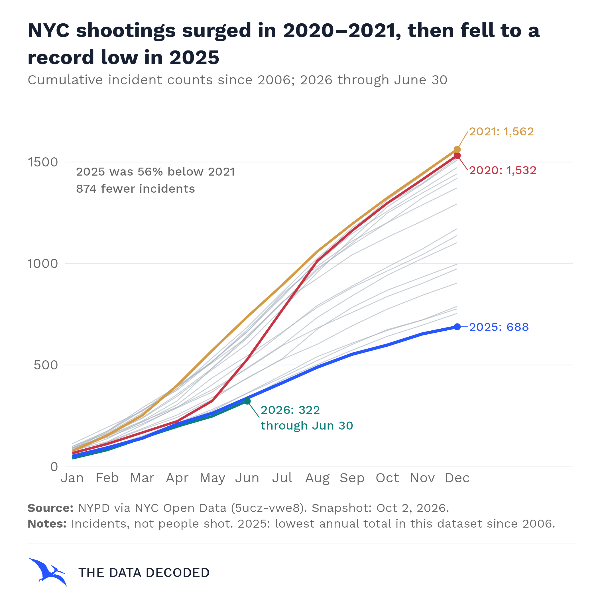
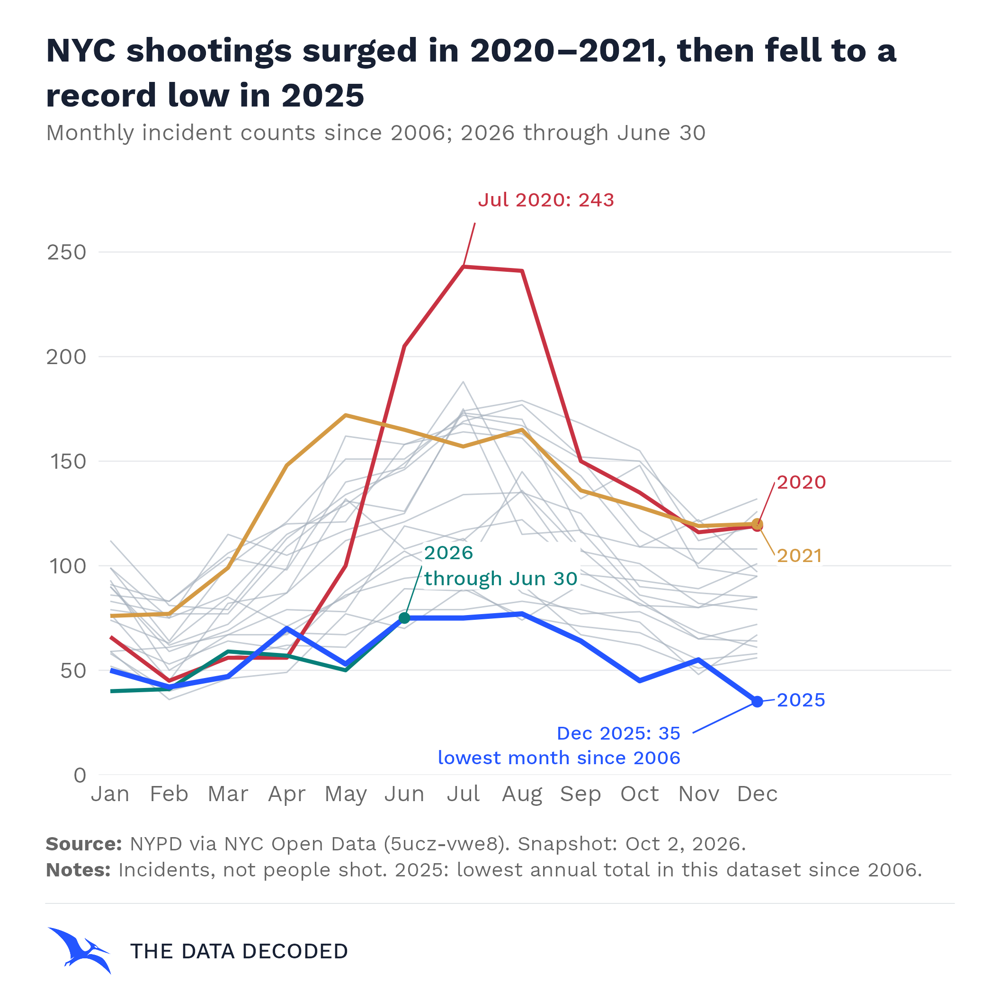

# X post draft

Status: unapproved. Review before posting.

NYC shootings surged in 2020–2021, then fell to a record low in 2025: the lowest annual incident total in this dataset since 2006. In the NYPD dataset, 2025 had 874 fewer incidents than 2021 (56% lower). The monthly view shows the timing; neither chart explains causes.

These are incident counts, not people shot. 2026 is shown only through June 30.

Source and definitions: NYC Open Data, NYPD Shootings dataset 5ucz-vwe8. Details and the 2025 source-table discrepancy are in the project page methodology.
